# 3D Render Physics


[](README.md#rychlý-start)
[](README.md#build-spuštění-a-testy)
[](README.md#rychlý-přehled)
[](README.md#tvrdá-data-a-ověřené-statistiky)

Čistě Java desktop editor a render sandbox zaměřený na počítačovou grafiku, CPU renderery, node-based materiály, editorové workflow a experimentální stylizované režimy. Program je navržený jako technický studentský projekt z grafiky: nesnaží se imitovat produkční DCC nebo produkční render engine, ale propojuje větší množství grafických subsystémů do jednoho konzistentního celku.

Autor: **Jiří Pelikán**

> [!NOTE]
> Build a test postup odpovídá aktuálním skriptům v repu. Výkonové tabulky níže jsou reprodukovatelný full snapshot z tests run-project-metrics skriptů[^bench].

> [!TIP]
> Pokud chceš jen rychlé pochopení projektu, jdi přes sekce Rychlý start, Rychlý přehled a Co program aktuálně umí.

> [!IMPORTANT]
> README je navržené jako hlavní čtecí plocha repozitáře: klíčová technická fakta jsou on-page bez nutnosti otevírat další soubory.

## GitHub README feature vrstva

| GitHub feature | K čemu slouží | Jak je použita zde |
| --- | --- | --- |
| Badges (Shields) | okamžitá orientace | Java, platformy, počet režimů, testy |
| Alert blocks | zvýraznění kritických informací | NOTE, TIP, IMPORTANT bloky nahoře |
| Anchor navigace | rychlý pohyb po dokumentu | skokové odkazy na sekce |
| Tabulky | kompaktní data | capability matrixe, benchmark přehledy |
| Mermaid diagramy | pipeline a workflow mapy | render a temporal noise diagramy |
| Math (KaTeX) | přesná formulace modelů | transformace, tracing, BRDF části |
| Code blocks | copy-paste workflow | build, test a benchmark příkazy |
| Task checklist | roadmap orientace | stav funkčních vrstev projektu |
| Footnotes | čistší text + zdrojové poznámky | metodika benchmarku a scope tvrzení |

### Rychlé skoky

| Start | Technologie | Data | Runtime |
| --- | --- | --- | --- |
| [Rychlý start](#rychlý-start) | [Renderery a stylizované režimy](#renderery-a-stylizované-režimy) | [Tvrdá data a ověřené statistiky](#tvrdá-data-a-ověřené-statistiky) | [UI a workflow editoru](#ui-a-workflow-editoru) |
| [Projekt v kostce](#projekt-v-kostce) | [Materiálový systém](#materiálový-systém) | [Výstup a export](#výstup-a-export) | [Ovládání a zkratky](#ovládání-a-zkratky) |

## Jak číst README

| Karta | Pro koho | Otevřít |
| --- | --- | --- |
| Spuštění projektu | Chci rychlý build, run a testy | [Rychlý start](#rychlý-start) · [Build, spuštění a testy](#build-spuštění-a-testy) |
| Produktový přehled | Chci během minuty vědět, co projekt umí | [Rychlý přehled](#rychlý-přehled) · [Co program aktuálně umí](#co-program-aktuálně-umí) · [UI a workflow editoru](#ui-a-workflow-editoru) |
| Technický rozbor | Chci architekturu, renderery a materiály | [Architektura programu](#architektura-programu) · [Renderery a stylizované režimy](#renderery-a-stylizované-režimy) · [Materiálový systém](#materiálový-systém) · [Temporal Noise](#temporal-noise) |
| Data a benchmarky | Chci čísla a reprodukovatelná měření | [Tvrdá data a ověřené statistiky](#tvrdá-data-a-ověřené-statistiky) |
| Limity a reference | Chci ovládání, strukturu repa a limity | [Ovládání a zkratky](#ovládání-a-zkratky) · [Struktura repozitáře](#struktura-repozitáře) · [Omezení a skutečný stav projektu](#omezení-a-skutečný-stav-projektu) · [Další technická dokumentace](#další-technická-dokumentace) |

README je rozdělené tak, aby nahoře fungovalo jako rychlý přehled na desktopu i na telefonu. Technické bloky jsou na stránce rozepsané přímo, aby nebylo nutné nic rozbalovat ani odcházet do files zobrazení.

### Seznam všech sekcí

- [Rychlý přehled](#rychlý-přehled)
- [Rychlý start](#rychlý-start)
- [Tvrdá data a ověřené statistiky](#tvrdá-data-a-ověřené-statistiky)
- [Co program aktuálně umí](#co-program-aktuálně-umí)
- [Architektura programu](#architektura-programu)
- [Renderery a stylizované režimy](#renderery-a-stylizované-režimy)
- [Světla, stíny, sklo a materiálová odezva](#světla-stíny-sklo-a-materiálová-odezva)
- [Matematické jádro](#matematické-jádro)
- [Materiálový systém](#materiálový-systém)
- [Temporal Noise](#temporal-noise)
- [Simulace a experimentální subsystémy](#simulace-a-experimentální-subsystémy)
- [Výstup a export](#výstup-a-export)
- [UI a workflow editoru](#ui-a-workflow-editoru)
- [Ovládání a zkratky](#ovládání-a-zkratky)
- [Import, primitiva a asset workflow](#import-primitiva-a-asset-workflow)
- [Build, spuštění a testy](#build-spuštění-a-testy)
- [Struktura repozitáře](#struktura-repozitáře)
- [Omezení a skutečný stav projektu](#omezení-a-skutečný-stav-projektu)
- [Další technická dokumentace](#další-technická-dokumentace)

## Projekt v kostce

| Oblast | Co to znamená v praxi |
| --- | --- |
| Co to je | Java desktop editor a render sandbox pro výuku a experimenty v počítačové grafice |
| Pro koho | Pro technický lookdev, test render pipeline, materiály a CPU benchmarky v jednom projektu |
| Největší síla | Jedna codebase propojuje editor, více rendererů, materiálový graph a export workflow |
| Co není cílem | Produkční DCC náhrada ani filmový render engine |
| Aktuální stav | Stabilní editor + raster/ray/path základ, experimentální vrstvy u stylizací a simulací |

### Stav projektu jako checklist

- [x] Editorové workflow stabilní
- [x] Raster viewport stabilní
- [x] Ray tracer stabilní
- [x] Path tracer stabilní
- [x] Materiálový graph produkčně použitelný v rámci projektu
- [ ] Část simulací je stále výzkumná vrstva
- [ ] Galaxy subsystém je zatím scaffold

## Rychlý start

### Požadavky

- `JDK 17+`
- `PATH` nebo `JAVA_HOME`

### Windows

```powershell
.\build.ps1
.\build.ps1 -Run
.\tests\run-tests.ps1
```

### Linux / macOS / Git Bash

```bash
./build.sh
./build.sh --run
./tests/run-tests.sh
```

Podrobný build, packaging a benchmark workflow je níže v [Build, spuštění a testy](#build-spuštění-a-testy).

## Rychlý přehled

| Oblast | Stav | Poznámka |
| --- | --- | --- |
| Editorové UI | stabilní | Swing/AWT, Blender-like layout |
| Raster viewport | stabilní | rychlé preview a stylizované módy |
| Viewport safety guard | stabilní | krátký recovery režim při přetížení, render failure nebo paměťovém tlaku |
| Ray tracer | stabilní | CPU offline renderer s BVH, stíny, odrazy a přenosem |
| Path tracer | stabilní | referenční CPU renderer pro lookdev a finální výstup |
| Materiálový graph | pokročilý | `MaterialNodeGraph` je authoring source of truth |
| Output workflow | stabilní | still / sequence / GIF / AVI (MJPEG), session folders |
| Spray / splash částice | experimentální | částicový overlay, ne fluid solver |
| Galaxy systém | experimentální scaffold | bez orbitálního nebo N-body solveru |

## Tvrdá data a ověřené statistiky

Tato sekce shrnuje čísla ověřená přímo nad aktuální codebase a referenční headless benchmarky vygenerované runnerem `tests/run-project-metrics.ps1` nebo `tests/run-project-metrics.sh`. Statistiky zdrojového stromu jsou rychle ověřitelné nad aktuálním repem; renderer benchmark tabulky níže používají `full` režim a fungují jako reprodukovatelný snapshot.

Krátká orientace:

- Pokud tě zajímá jen stav projektu, stačí [Rychlý přehled](#rychlý-přehled) a [Co program aktuálně umí](#co-program-aktuálně-umí)
- Pokud tě zajímá výkon, benchmarky níže jsou reprodukovatelné a navázané na skripty v `tests/`
- Pokud čteš README na telefonu, benchmarky níže jsou seřazené od stručných tabulek po detailní grafy

### Statistika codebase

| Metrika | Hodnota |
| --- | ---: |
| Java soubory v `src` | 225 |
| Neblank Java řádky v `src` | 65 201 |
| Java soubory v `tests` | 65 |
| Neblank Java řádky v `tests` | 13 126 |
| Automatické test suite entry pointy | 50 |
| Render módy | 9 |
| Node typy materiálového graphu | 24 |
| Materiálové presety | 9 |
| Preview primitiva | 3 |
| Preview light presety | 5 |
| Preview background režimy | 3 |
| Preview render režimy | 3 |
| Typy exportu | 4 |
| Základní primitiva | 9 |
| Featured primitiva | 2 |

### Import / export data

| Oblast | Aktuální stav |
| --- | --- |
| Import filtr v UI | `OBJ`, `STL`, `GLTF`, `GLB`, `FBX` |
| Nativně obsloužené import cesty | `OBJ`, `STL`, `GLTF`, `GLB` |
| FBX větev | filtr existuje, importer ji poctivě hlásí jako unsupported |
| Výstupní typy | `STILL`, `IMAGE_SEQUENCE`, `ANIMATED_GIF`, `ANIMATED_AVI` |

### Rozdělení automatických testů

| Kategorie | Počet suite entry pointů |
| --- | ---: |
| Rendering | 19 |
| Materiály | 3 |
| Import / IO | 5 |
| Editor / core | 7 |
| Kvalita / prezentace | 2 |
| Ostatní | 14 |

### Benchmark metodika a transparentní parametry

| Parametr | Hodnota |
| --- | --- |
| Java runtime | `17.0.18` / `OpenJDK 64-Bit Server VM` |
| OS | Windows 11 / `amd64` |
| Logické procesory | `16` |
| Renderer benchmark mode | `full` |
| Izolace případů | samostatný child JVM proces pro každý case |
| Core profily | `Single core = 1 worker`, `Scaled CPU (70%) = 12 worker` |
| Viewport rozlišení | `320x180`, `640x360`, `1920x1080` |
| Offline rozlišení | `160x90`, `320x180`, `640x360`, `1920x1080` |
| Workload fáze | first-frame = `init + první render` na čerstvé instanci po case primingu, steady-frame = render po warm-upu |
| Workload profily | `static-steady` = statická scéna + statická kamera, `dynamic-sequence` = viewport sekvence s orbit kamerou a `scene.update(time)` |
| Statistika | `min`, `median`, `mean`, `p90`, `max`, `stddev` z realných sample, žádný `median-z-mediánů` |
| Kamera | perspective, `FOV 60 deg`, aspect podle rozlišení, pozice `(0.0, 1.3, 7.4 +/- bias)` |
| Benchmark host JVM | `17.0.18` / `OpenJDK 64-Bit Server VM`, `Windows 11 10.0`, runtime processors `16`, max memory `7120 MB` |
| Benchmark CPU descriptor | `AMD64 Family 25 Model 117 Stepping 2, AuthenticAMD` |
| Per-case child metadata | `runtime_processors`, `max_memory_mb`, `java_*`, `os_*`, `cpu_descriptor` jsou v CSV po každém case; `Scaled CPU` child typicky vidí počet procesorů podle `ActiveProcessorCount` |
| Poznámka | viewport a offline renderery mají oddělené resolution matice; interní optimalizace rendererů zůstávají zapnuté a CSV obsahuje i per-case runtime metadata |
| Export benchmark zdroj | `8` předpřipravených PHONG frameů na daném rozlišení |
| Export benchmark formáty | `PNG still`, `JPG still`, `PNG sequence`, `GIF`, `AVI MJPEG` |
| JPG kvalita | `0.92` |
| GIF | `8` snímků, `24 FPS`, loop forever |
| AVI | `8` snímků, `24 FPS`, MJPEG quality `0.90` |

### Benchmark scénáře

| Scéna | Mesh entity | Světla | Trojúhelníky |
| --- | ---: | ---: | ---: |
| Lehká scéna / málo světel | 5 | 2 | 2 132 |
| Lehká scéna / více světel | 5 | 7 | 2 132 |
| Těžká scéna / málo světel | 9 | 2 | 21 228 |
| Těžká scéna / více světel | 9 | 10 | 21 228 |

### Referenční headless benchmark rendererů: `static-steady` workload v `full` režimu

| Renderer | Family | Core profil | Počet case | First-frame geo median [ms] | Steady-frame geo median [ms] | Worst steady median [ms] |
| --- | --- | --- | ---: | ---: | ---: | ---: |
| Raster / PHONG | Viewport | Scaled CPU (70%) | 12 | 9.98 | 4.36 | 12.43 |
| Hex Mosaic | Viewport | Scaled CPU (70%) | 12 | 44.32 | 7.90 | 28.51 |
| Temporal Noise | Viewport | Scaled CPU (70%) | 12 | 67.24 | 8.72 | 28.99 |
| Dithering | Viewport | Scaled CPU (70%) | 12 | 25.45 | 16.33 | 57.99 |
| Ray Tracing | Offline | Scaled CPU (70%) | 16 | 71.96 | 36.00 | 561.02 |
| Path Tracing | Offline | Scaled CPU (70%) | 16 | 183.33 | 129.00 | 2687.38 |
| Raster / PHONG | Viewport | Single core | 12 | 14.76 | 9.82 | 63.85 |
| Temporal Noise | Viewport | Single core | 12 | 67.13 | 11.64 | 42.61 |
| Hex Mosaic | Viewport | Single core | 12 | 48.16 | 14.00 | 81.52 |
| Dithering | Viewport | Single core | 12 | 35.47 | 23.93 | 120.07 |
| Ray Tracing | Offline | Single core | 16 | 153.44 | 107.55 | 2689.46 |
| Path Tracing | Offline | Single core | 16 | 711.32 | 625.35 | 18375.13 |

### Dynamic viewport audit pro reálnější závěr

`dynamic-sequence` je záměrně jen pro viewport family. Audit bere nejtěžší scénu a maximální viewport rozlišení, takže ukazuje, co se stane, když renderer nemůže pohodlně reuseovat statický frame state.

| Renderer | Core profil | Scéna | Rozlišení | Static steady [ms] | Dynamic steady [ms] | Slowdown | Static first [ms] | Dynamic first [ms] |
| --- | --- | --- | ---: | ---: | ---: | ---: | ---: | ---: |
| Raster / PHONG | Scaled CPU (70%) | Těžká scéna / více světel | 1920x1080 | 12.43 | 12.57 | 1.01x | 18.73 | 16.92 |
| Hex Mosaic | Scaled CPU (70%) | Těžká scéna / více světel | 1920x1080 | 28.51 | 28.99 | 1.02x | 171.64 | 169.22 |
| Dithering | Scaled CPU (70%) | Těžká scéna / více světel | 1920x1080 | 57.99 | 58.05 | 1.00x | 72.69 | 71.95 |
| Temporal Noise | Scaled CPU (70%) | Těžká scéna / více světel | 1920x1080 | 27.65 | 216.17 | 7.82x | 293.02 | 260.82 |
| Raster / PHONG | Single core | Těžká scéna / více světel | 1920x1080 | 63.85 | 61.70 | 0.97x | 67.04 | 58.59 |
| Hex Mosaic | Single core | Těžká scéna / více světel | 1920x1080 | 81.52 | 78.01 | 0.96x | 204.52 | 203.13 |
| Dithering | Single core | Těžká scéna / více světel | 1920x1080 | 120.07 | 115.71 | 0.96x | 126.23 | 119.26 |
| Temporal Noise | Single core | Těžká scéna / více světel | 1920x1080 | 42.48 | 242.75 | 5.71x | 308.77 | 280.54 |

Poměry kolem `0.9x až 1.1x` mimo `Temporal Noise` nečti jako „pohyb kamerou pomáhá“. To je běžný rozptyl delšího CPU benchmarku. Důležitá informace je, že tyto rendery zůstávají zhruba ve stejné třídě náročnosti, zatímco `Temporal Noise` se v dynamice propadá výrazně nahoru.

### Stress case na maximálním rozlišení (`static-steady`, `heavy-many`)

| Renderer | Core profil | First median [ms] | Steady median [ms] | Steady p90 [ms] |
| --- | --- | ---: | ---: | ---: |
| Raster / PHONG | Scaled CPU (70%) | 18.73 | 12.43 | 13.45 |
| Temporal Noise | Scaled CPU (70%) | 293.02 | 27.65 | 29.87 |
| Hex Mosaic | Scaled CPU (70%) | 171.64 | 28.51 | 31.04 |
| Dithering | Scaled CPU (70%) | 72.69 | 57.99 | 58.81 |
| Path Tracing | Scaled CPU (70%) | 2865.78 | 2687.38 | 2860.27 |
| Ray Tracing | Scaled CPU (70%) | 574.12 | 561.02 | 588.91 |

### Graf 1: Viewport `static-steady` škálování podle rozlišení

`full` mode, `Scaled CPU (70%)`, průměr steady median přes všechny 4 benchmark scénáře v `static-steady` workloadu.

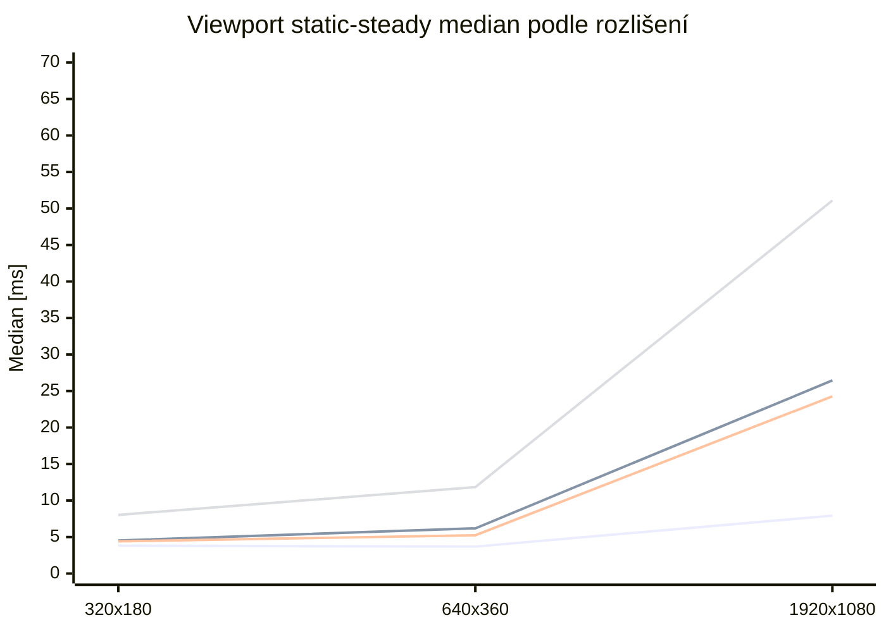

Graf ukazuje statický steady-state baseline viewport family. `Raster / PHONG` zůstává referenční minimum, `Temporal Noise` a `Hex Mosaic` se lámají hlavně ve fullHD a `Dithering` je nejcitlivější na růst počtu pixelů.

### Graf 2: Offline `static-steady` škálování podle rozlišení

`full` mode, `Scaled CPU (70%)`, průměr steady median přes všechny 4 benchmark scénáře.

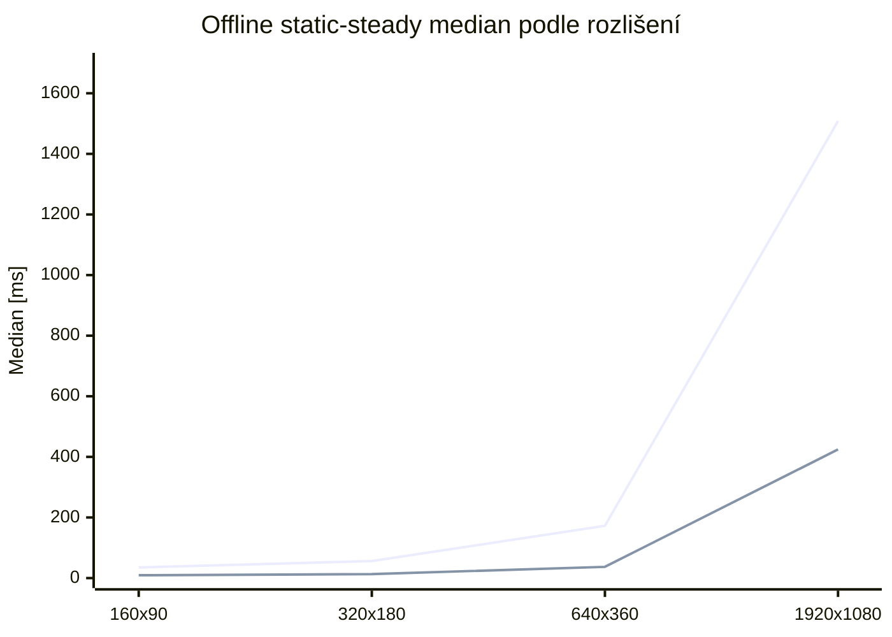

Je zde vidět násobení s počtem pixelů i odlišný charakter obou offline rendererů v aktuální konfiguraci benchmarku. V tomto měření vychází `Path Tracing` výrazně náročněji než `Ray Tracing`.

### Graf 3: First-frame vs. steady-frame v nejtěžším `static-steady` stress case

`heavy-many`, nejvyšší rozlišení dané renderer family, `Scaled CPU (70%)`.

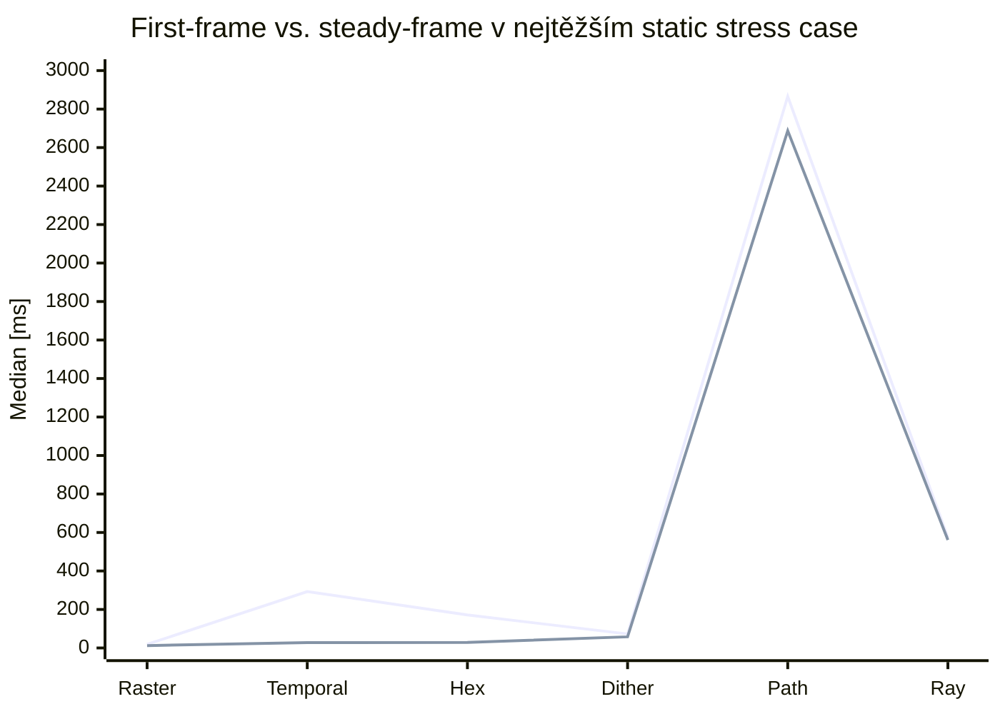

Tenhle graf je důležitý hlavně pro interpretaci `Temporal Noise` a `Hex Mosaic`: první snímek je výrazně dražší než ustálený běh, protože se budují pomocné mapy a analýza. U offline rendererů je rozdíl mezi first a steady menší, protože dominantní cena je samotný tracing.

### Graf 4: Static vs. dynamic steady-frame audit

`heavy-many`, `1920x1080`, `Scaled CPU (70%)`, jen viewport family.

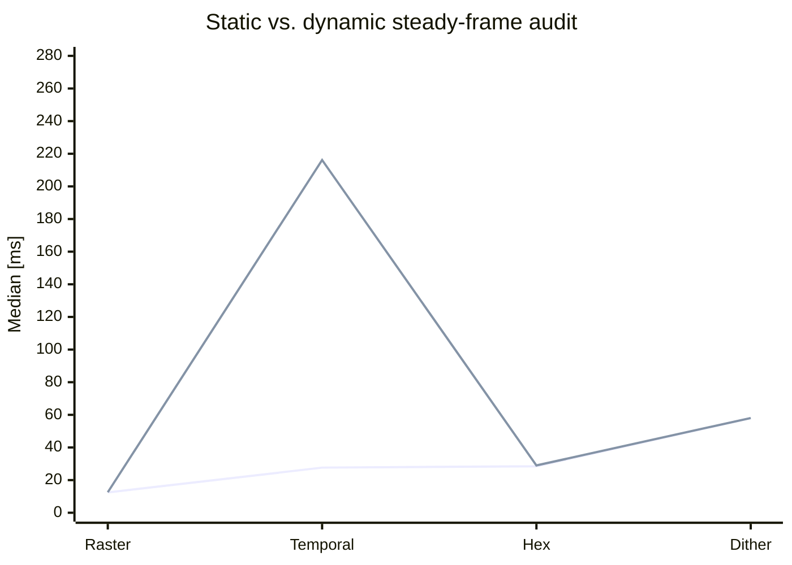

Tenhle graf je klíčový pro reálný závěr. Ve statickém workloadu vypadá `Temporal Noise` velmi dobře, ale jakmile benchmark mezi framy hýbe kamerou a aktualizuje scénu, steady cost vyskočí výrazně nahoru. Ostatní viewport renderery zůstávají přibližně tam, kde byly.

### Co z benchmarku jde reálně vyvozovat

- `Raster / PHONG` je referenční rychlý viewport baseline. Jedna klasická raster pipeline bez dodatečné full-screen syntézy se v datech chová přesně tak, jak odpovídá jeho složitosti.
- `Temporal Noise` má dva legitimní režimy chování. Ve `static-steady` workloadu padá nízko díky reuse analýzy, ale `dynamic-sequence` ukazuje, že pro pohyb kamerou to není levný renderer; ve fullHD heavy-many roste steady median na `216.17 ms` (`Scaled CPU`) a `242.75 ms` (`Single core`).
- `Hex Mosaic` a `Dithering` jsou záměrně měřené se zapnutými interními passy. Benchmark tedy neporovnává „stejný shader ve stejné pipeline“, ale reálné defaultní workloady těch rendererů.
- `Ray Tracing` a `Path Tracing` jsou uváděné odděleně od viewport family. Jejich absolutní časy jsou ovlivněné BVH, shadow rays, přímým světlem a `1 SPP` nastavením; porovnání má smysl hlavně uvnitř offline family.
- V aktuálním `full` snapshotu je `Ray Tracing` levnější než `Path Tracing`, zejména ve vyšších rozlišeních.
- `Scaled CPU (70%)` je záměrně kompromisní profil pro reálné desktop použití. Benchmark tak netlačí počítač na plných `100 %` všech jader a výsledky jsou bližší tomu, co dává smysl pro editorový provoz.
- To pořád není laboratorní benchmark. Není tu affinity pinning, multi-machine cross-check ani thermal governance. Na závěr v rámci tohoto repa to ale už stačí: statický baseline, dynamický audit i per-case runtime metadata jsou transparentní a reprodukovatelné.

### Hrubá matematická a výpočetní složitost

Použité symboly:
- `V` = počet vrcholů
- `T` = počet trojúhelníků
- `P` = počet pixelů (`width * height`)
- `L` = počet aktivních světel
- `C` = počet buněk / cell struktur v postprocesu
- `D` = maximální ray depth / počet bounce

| Renderer | Přibližný dominantní tvar | Co to znamená v praxi |
| --- | --- | --- |
| Raster / PHONG | `O(V + T * tileOverlap + P * L)` | klasická raster pipeline, nejnižší konstanty, dobrý viewport baseline |
| Dithering | `O(2 * Raster + P)` | lit base pass + unlit detail reference + full-screen syntéza; proto je nejdražší viewport steady renderer |
| Temporal Noise | first-frame přibližně `O(Raster_unlit + P + neighborhood analysis)`, steady ve statické scéně blíž k `O(Raster_unlit + P)`, v dynamice zase blíž k first-frame cost | statická kamera ho zvýhodní, dynamická sekvence odhalí skutečnou cenu re-analýzy |
| Hex Mosaic | `O(Raster + P + C)` | base raster + per-pixel akumulace do buněk + compose; roste víc s pixely než čistý raster |
| Ray Tracing | first-frame přibližně `O(T log T + P * D * (BVH + L * shadowBVH))`, steady bez rebuildů hlavně `O(P * D * (BVH + L * shadowBVH))` | světla a shadow rays bolí víc než samotný růst geometrie |
| Path Tracing | `O(T log T + P * E[D] * (BVH + L * shadowBVH))` | stejný řád jako ray tracer; v aktuálním full benchmarku vychází náročněji |

Tyhle tvary nejsou formální důkaz přesné complexity každého řádku kódu; jsou to zjednodušené dominantní modely, které odpovídají tomu, co renderery v téhle codebase skutečně dělají a co benchmark naměřil.

### Export benchmark podle formátu a rozlišení

Tato tabulka měří čistě zápis formátu nad připravenými snímky. Nejde tedy o plný čas `render + export`, ale o samotnou náročnost export pipeline pro jednotlivé formáty.

| Formát | 640x360 median [ms] | 640x360 velikost | 1280x720 median [ms] | 1280x720 velikost | 1920x1080 median [ms] | 1920x1080 velikost |
| --- | ---: | ---: | ---: | ---: | ---: | ---: |
| PNG still | 19.25 | 0.02 MB | 45.33 | 0.08 MB | 61.85 | 0.20 MB |
| JPG still | 16.32 | 0.01 MB | 23.06 | 0.02 MB | 34.75 | 0.04 MB |
| PNG sequence | 77.30 | 0.12 MB | 220.01 | 0.62 MB | 466.52 | 1.64 MB |
| GIF | 206.09 | 0.31 MB | 724.14 | 0.91 MB | 1610.70 | 1.87 MB |
| AVI MJPEG | 56.12 | 0.06 MB | 152.85 | 0.18 MB | 288.72 | 0.35 MB |

> Benchmark tabulka je určená jako reprodukovatelný referenční údaj pro tento repozitář, ne jako absolutní srovnání s jinými enginy. Smysl tabulek je ukázat relativní náklad rendererů v rámci stejné codebase, stejného runneru a transparentně popsaných workloadů.

## Co program aktuálně umí

- Blender-like rozložení editoru: toolbar nahoře, viewport uprostřed, properties vpravo, spodní workspace dock.
- Software raster renderer pro rychlý viewport.
- CPU `RayTracerRenderer` a `PathTracerRenderer`.
- Stylizované režimy `Wireframe`, `Dithering`, `Temporal Noise` a `Hex Mosaic`.
- Dither pipeline se sdíleným adaptivním kontrastem a `ASCII` variantou, která vybírá glyph podle podobnosti skutečného obrazového bloku.
- Materiálový workspace s node graph editorem, preview panelem a inspektorem uzlů.
- Sdílené materiálové vyhodnocení napříč raster/ray/path renderery.
- Import modelů `OBJ`, `STL`, `glTF`, `GLB`, `FBX`.
- Output workflow pro statický snímek, sekvenci, GIF a AVI (MJPEG) bez externích nástrojů.
- Session-based export s `manifest.json`, `preview.png`, `log.txt` a oddělenými session složkami.
- Časovou osu, klíčování a základní editorovou historii.
- Lehký viewport safety guard, který při přetížení krátce podrží frame a dočasně stáhne interní náročnost.
- Experimentální spray/splash emitter a scaffold pro galaxy systém.

## Architektura programu

Program používá modulární rozdělení podle odpovědností:

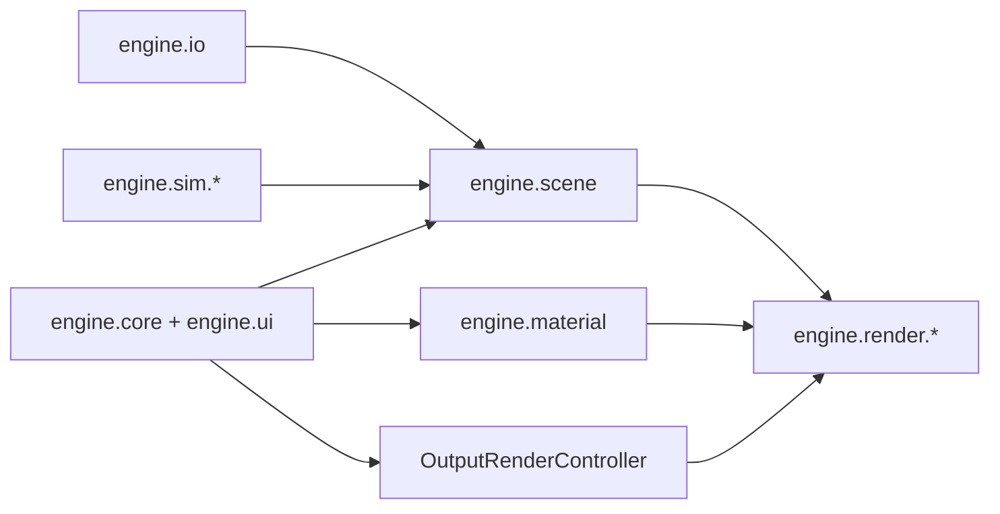

### Praktické členění

- `engine.core`
  - lifecycle aplikace,
  - toolbar, properties, docky,
  - history, shortcut routing, output workflow.
- `engine.render`
  - raster renderer,
  - ray tracer,
  - path tracer,
  - stylizované post/styl renderery.
- `engine.material`
  - `PhongMaterial` jako kompatibilní obálka,
  - `MaterialNodeGraph` jako authoring source of truth,
  - evaluace graphu, preview, texture-set import.
- `engine.scene`
  - entity, světla, transformace, scéna.
- `engine.sim`
  - experimentální simulace a overlay subsystémy.
- `engine.io`
  - import modelů a parsování souborových formátů.

## Renderery a stylizované režimy

### Přehled render režimů

| Režim | Implementace | Účel | Rychlost | Poznámka |
| --- | --- | --- | --- | --- |
| `MODEL` | lehký raster preview | blokování tvaru a navigace | velmi vysoká | bez plného materiálového výsledku |
| `BASIC` | jednoduchý raster | rychlý layout | vysoká | základní barevný náhled |
| `PHONG` | hlavní viewport raster | běžná práce ve viewportu | vysoká | hlavní realtime preview |
| `WIREFRAME` | stylizovaný edge renderer | kontrola topologie a siluet | vysoká | volitelné skryté hrany / silueta |
| `DITHERING` | post styl | stylizovaný obraz | střední | styly `BLUE_NOISE`, `PATTERN`, `ASCII`; `ASCII` vybírá glyph podle podobnosti obrazového bloku |
| `TEMPORAL_NOISE` | post styl nad G-bufferem | motion-defined forma z pohybu šumu | střední | integer 2D grain, regionální posuv |
| `HEX_MOSAIC` | post styl | stylizovaná hex mozaika | střední | buňka, outline, theme |
| `RAY_TRACING` | CPU ray tracer | kvalitnější offline preview | nižší | stíny, odrazy, přenos |
| `PATH_TRACING` | CPU path tracer | referenční lookdev / finální výstup | nejnižší | nejvěrnější interpretace materiálů |

### Raster vs. Ray vs. Path

| Oblast | Raster | Ray | Path |
| --- | --- | --- | --- |
| Surface shading | preview aproximace | silná interpretace | referenční interpretace |
| Glass / transmission | omezená aproximace | použitelná | nejlepší varianta v projektu |
| Transparent BSDF | aproximace | použitelný | použitelný |
| Volume medium | homogenní preview aproximace | omezené homogenní médium | nejlepší homogenní médium v projektu |
| Normal map | ano | ano | ano |
| Mix Shader | aproximovaný sample | smysluplné closure mixing | smysluplné closure mixing |

### Hlavní render nastavení v UI

| Oblast | Nastavení |
| --- | --- |
| Globální viewport | frustum culling, backface culling, paralelní raster, post AA, progresivní viewport, culling podle vzdálenosti, fallback režim, cílové FPS, render scale, počet vláken |
| Wireframe | hloubkově skryté hrany, zvýraznění siluety, přerušované hrany |
| Dither | styl, počet tónů, kontrast, světelná pomoc, invert; v `ASCII` navíc velikost buňky a ASCII znaková sada |
| Temporal Noise | tempo posuvu, blízkostní příspěvek, příspěvek šikmého úhlu, minimální rychlost, maximální rychlost, síla okrajového blendu, velikost zrna, úrovně palety |
| Hex Mosaic | velikost buňky, kvantizace, outline, wow strength, theme, edge aware, škálování vzdáleností, debug buněk |
| Ray Tracing | vzorky / snímek, tile size, diffuse/glossy/transmission/volume/transparent depth, přímé světlo, stíny, odrazy, denoise |
| Path Tracing | vzorky / snímek, tile size, diffuse/glossy/transmission/volume/transparent depth, přímé světlo, obloha, denoise |

### Dither / ASCII

`DitherRenderer` už nepracuje jen jako jednoduché prahování nad průměrným jasem.

- `BLUE_NOISE` a `PATTERN` sdílejí připravenou luminanci s adaptivním kontrastem, světelnou pomocí a obnovou detailu.
- `ASCII` pro každou buňku normalizuje malý blok obrazu, porovná ho s bitmapami kandidátních glyphů a vybere znak s nejmenší chybou.
- `Počet tónů`, `Kontrast`, `Světelná pomoc` a `Invertovat` fungují napříč všemi dither styly.
- `Velikost buňky` a `Znaková sada ASCII` se v UI ukazují jen pro `ASCII`, aby v panelu nezůstávaly mrtvé volby.
- Při `ASCII` se ve viewportu záměrně vypíná adaptivní interní scale, aby mřížka buněk neproblikávala při pohybu.

### Render pipeline

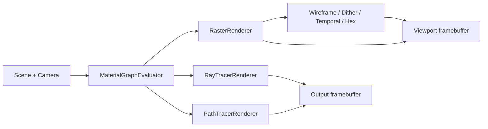

## Světla, stíny, sklo a materiálová odezva

Tato část je implementační a datová: popisuje fyzikální aspekty světla, které jsou v projektu skutečně řešené v ray/path pipeline.

### 1. Základní světelná rovnice v projektu

Pro ray/path větve je výstupní radiance skládaná jako průběžné sčítání příspěvků po bounce:

$$
\mathbf{L} \leftarrow \mathbf{L} + \mathbf{T}\odot\left(\mathbf{L}_{direct}+\mathbf{L}_{emission}+\mathbf{L}_{env}\right)
$$

$$
\mathbf{T}_{k+1}=\mathbf{T}_k\odot\mathbf{w}_{branch}
$$

Luminance pro rozhodování o ukončení větve je v kódu vedena jako:

$$
Y = 0.2126R + 0.7152G + 0.0722B
$$

### 2. BRDF pravidla, která jsou reálně použita

| Pravidlo | Implementační chování |
| --- | --- |
| Fresnel | Schlick varianta (`schlickFresnel` a `schlickFresnelColor`) |
| Specular lobe | GGX (`ggxSpecularTerm`) |
| Clearcoat | samostatný GGX lobe + Fresnel s F0 = 0.04 |
| Sheen | samostatný `sheenLobeTerm` (lze vypnout v motion carrier profilu) |
| Multi-scatter kompenzace | path má `GGX_MULTISCATTER_STRENGTH = 0.55` |

Schlick Fresnel forma:

$$
F(\cos\theta)=F_0+(1-F_0)(1-\cos\theta)^5
$$

### 3. Vlnová délka světla a `SPECTRAL_BAND_COUNT` workflow

Path tracer má explicitní spektrální vrstvu (hybrid RGB + spektrální výpočet):

- `SPECTRAL_BAND_COUNT = 14`
- rozsah pásem: `390 nm .. 720 nm`
- spektrální báze (Gauss):
  - R centrum `610 nm`, sigma `45`
  - G centrum `545 nm`, sigma `38`
  - B centrum `455 nm`, sigma `30`

Jak s tím engine pracuje krok po kroku:

1. Spektrální režim se aktivuje v plném still-tier průchodu (`spectral14Active = fullStillTierActive`).
2. Pro každý path se vybere `hero band` a k němu `companion band` (přibližně opačná část spektra).
3. RGB vstupy (`env`, `emission`, části BRDF/Fresnel) se promítnou do spektrální reprezentace přes `spectralHeroProjectRgb(...)`.
4. Spektrální odezva se vrací zpět do RGB přes interní báze, takže výstup jde pořád do RGB framebufferu, ale mezivýpočet už respektuje vlnovou závislost.
5. Pokud spektrální režim aktivní není, běží fallback přes kanálové `dispersedIor(..., -1/0/+1)`.

Tím je propojené „klasické RGB“ i „fyzikální spektrální“ chování: nejde o čistý full-spectral renderer, ale ani o čistě trikanálovou aproximaci.

Vnitřní fyzikální vazba je v zásadě:

$$
\eta = \eta(\lambda),\quad F = F(\lambda,\cos\theta),\quad T = T(\lambda, d),\quad \mathbf{L}_{rgb}=\int_{\lambda_{min}}^{\lambda_{max}} L(\lambda)\,\mathbf{b}_{rgb}(\lambda)\,d\lambda
$$

Právě tato řada (`ior -> Fresnel -> transmission -> throughput`) vysvětluje, proč se spektrální chování promítne nejen do skla, ale i do intenzity stínů, caustic koncentrace a RR přežití dalších bounce.

### 4. Lom světla, IOR a disperze

Lom je řešen explicitně přes refrakci směru paprsku a materiálový index lomu:

$$
\mathbf{d}_{refr} = refract(\mathbf{d},\mathbf{n},\eta)
$$

Kde:

- `ior` je drženo minimálně na `>= 1.0` (material graph i material třídy),
- `dispersion` je clampována na `0..1`,
- v path traceru je použita spektrální disperze s konstantou `DISPERSION_IOR_SPREAD = 0.06`.

Prakticky: při nenulové disperzi se efektivní IOR mění podle spektrální složky, takže světlo není jen „jedna bílá lomová stopa“, ale kanálově/spektrálně odlišená odezva.

Vazba na ostatní fyzikální části:

- lom/disperze ovlivní branch volbu (`transmission` vs. `spec/clearcoat`),
- branch výsledek vstupuje do throughputu a tím do energie dalších bounce,
- stejný path pak vstupuje do RR (ukončení) i do caustic carry/boost modelu,
- u volumetrie se na lom naváže medium transmittance (`mediumDirectionalTransmittance`).

### 5. Fyzikální branch pravidla pro sklo a materiál

Path tracer staví branch pravděpodobnosti explicitně (preview transport):

$$
p_t = clamp01(transmission\cdot(1-fresnel))
$$

$$
p_c = clamp01(clearcoatFactor),\quad
p_s = clamp01(max(reflectivity,fresnel))\cdot(1-p_c)
$$

$$
p_d = clamp01(1-p_t-p_c-p_s)
$$

To je přesně důvod, proč glass/transmission odezva v path módu není jen "efekt", ale branch-driven integrace s vazbou na IOR, roughness a Fresnel.

### 6. Stíny a area světla: konkrétní datové chování

Ray tracer má explicitní pravidlo pro area shadow samples (`resolveAreaShadowSamples`):

- v klidu kamery: min `12`, max `64`, navýšení proti base vzorkování,
- při pohybu: redukce area samples na přibližně `65 %` (pokud je vzorků více než 1).

To je důvod, proč při pohybu klesá měkkost/čistota stínů a po zastavení se opět vrací.

### 7. Russian roulette a ukončení drah

Path tracer používá RR pro delší dráhy; survival pravděpodobnost je svázaná s throughputem:

$$
rr = clamp\left(max(T_r,T_g,T_b),\ 0.05,\ 0.98\right)
$$

$$
P(continue)=rr,\qquad \mathbf{T}\leftarrow\mathbf{T}/rr
$$

Kromě RR existuje i explicitní motion ukončení větve podle luminance throughputu:

$$
Y(\mathbf{T}) \le \tau_{motion} \Rightarrow \text{terminate path}
$$

kde $\tau_{motion}$ odpovídá `previewMotionThroughputTermination`.

### 8. Volume, absorpce a Beer-Lambert chování

Renderer pracuje s homogenním volumem (ne plný heterogenní solver). V kódu se projeví přes transmittance faktor `tr` a příspěvek `1-tr`:

$$
L_{vol,emit} \propto (1-tr),\qquad
\mathbf{T}\leftarrow\mathbf{T}\cdot tr
$$

Konceptuálně odpovídá Beer-Lambert zákonitosti:

$$
tr \approx e^{-\sigma_t d}
$$

V kódu jsou navíc explicitní limity a parametry globálního homogenního media:

- `globalVolumeDensity` je clampováno do `0..4.0`,
- volumetrická emise je držena nezápornou (`>= 0` pro RGB složky),
- volume je kombinováno s throughputem po segmentech i při miss/exit větvi.

### 9. Caustics a optický carry model

Path tracer má explicitní caustic guidance/carry vrstvu (není to jen náhodný šum):

- `CAUSTIC_BOOST_MAX = 1.45`
- carry decay po bounce:
  - delta event: `0.74`
  - non-delta event: `0.48`

Direct contribution může být škálovaný caustic boost faktorem podle optické cesty a typu povrchu, což zlepšuje čtení světelných koncentrací za lomivými/odrazivými materiály.

### 10. Které fyzikální jevy jsou reálně pokryté

| Fyzikální jev | Stav v projektu |
| --- | --- |
| Fresnel odrazivost | ano (Schlick + spektrální varianta) |
| Lom světla (Snell-like refrakce směru) | ano |
| Dispersion (závislost na vlnové délce) | ano, spektrální ior spread |
| Spektrální sampling (vlnové pásmo) | ano, 14 pásmy 390-720 nm |
| GGX mikrofacet specular | ano |
| Clearcoat druhý lobe | ano |
| Sheen lobe | ano |
| Homogenní volumetrická absorpce/transmittance | ano |
| Emisivní volumetrický příspěvek | ano |
| Polarizace světla | ne |
| Interference/difrakce | ne |
| Heterogenní volumetrický transport (full) | ne (jen homogenní model) |

### 11. Přesné rozsahy parametrů (z implementace)

| Parametr | Ray | Path |
| --- | --- | --- |
| `samplesPerFrame` | `1..64` | `1..64` |
| `maxDepth` / `maxBounces` | `1..32` | `1..32` |
| `previewMotionSamplesPerFrameLimit` | `0..64` | `0..64` |
| `previewMotionMaxDepth/Bounces` | `0..32` | `0..32` |
| `previewMotionSecondaryCadence` | `1..8` | `1..8` |
| `previewMotionTileSubsetCadence` | `1..16` | `1..16` |
| `previewMotionDenoiseCadence` | `1..8` | `1..8` |
| `previewMotionMaxLocalLights` | `-1..16` | `-1..16` |
| `previewMotionMaxShadowedLocalLights` | `-1..16` | `-1..16` |
| `previewMotionThroughputTermination` | `0.0..1.0` | `0.0..1.0` |
| `previewMotionRoughnessSecondarySkip` | `0.0..1.0` | `0.0..1.0` |

Ray má navíc implementační rozsahy:

- `previewMotionPolishScale`: `0.08..1.0`
- `previewMotionBaseShadingScale`: `0.18..1.0`

### 12. Datové defaulty relevantní pro světlo/stín/materiál

| Oblast | Default v kódu |
| --- | --- |
| Ray `maxDepth` | `3` |
| Path `maxBounces` | `4` |
| Ray `directLighting` | `true` |
| Path `directLighting` | `true` |
| Ray `shadowsEnabled` | `true` |
| Ray `reflectionsEnabled` | `true` |

### 13. Co to znamená pro praktický lookdev

1. Pro validní čtení stínů a odrazů nehodnotit jen motion frame; still fáze má jiný quality profil.
2. U skla kontrolovat branch chování (transmission/spec/clearcoat), ne jen jednu statickou screenshot hodnotu.
3. Při ladění materiálu držet oddělené cíle: viewport rychlost (motion tier) a fyzikální věrnost (still/reference tier).
4. Finální rozhodnutí o světelném setupu dělat až po kontrole path konvergence (RR + throughput + depth budget).

## Matematické jádro

Tato sekce shrnuje hlavní matematické vztahy, které program skutečně používá nebo které přímo odpovídají aktuální implementaci.

### 1. Transformace vrcholů

Raster větev převádí vrcholy přes modelovou, view a projekční transformaci do clip prostoru a potom do `NDC` a screen-space:

$$
\mathbf{p}_{world} = M \cdot \begin{bmatrix}x \\ y \\ z \\ 1\end{bmatrix}
$$

$$
\mathbf{p}_{clip} = VP \cdot \mathbf{p}_{world}
$$

$$
\mathbf{p}_{ndc} = \frac{\mathbf{p}_{clip.xyz}}{w_{clip}}
$$

$$
x_{screen} = \left(\frac{x_{ndc}}{2} + \frac{1}{2}\right)(W-1), \qquad
y_{screen} = \left(1 - \left(\frac{y_{ndc}}{2} + \frac{1}{2}\right)\right)(H-1)
$$

World-space normály se transformují přes `normalMatrix`, tj. horní levou `3x3` část inverse-transpose modelové matice.

### 2. Ray tracer a path tracer

Oba offline renderery používají akceleraci přes BVH a drží průchod paprsku ve standardním tvaru:

$$
\mathbf{r}(t) = \mathbf{o} + t\mathbf{d}
$$

Oba renderery drží barevný throughput:

$$
\mathbf{T}_{k+1} = \mathbf{T}_{k} \odot \mathbf{w}_{branch}
$$

Celková radiance se skládá z emisí, přímého světla a navazujících větví:

$$
\mathbf{L} = \sum_k \mathbf{T}_k \odot \left(\mathbf{L}_{direct,k} + \mathbf{L}_{emission,k}\right)
$$

#### Ray tracer

`RayTracerRenderer` je determinističtější offline renderer. V každém zásahu:

- vyhodnotí přímé osvětlení přes směrová a bodová světla,
- z materiálu odvodí odraz, přenos a lokální váhu povrchového příspěvku,
- pokračuje jednou dominantní větví, ne plným stochastickým stromem.

Lokální specular term používá half-vector:

$$
\mathbf{h} = \frac{\mathbf{l} + \mathbf{v}}{\|\mathbf{l} + \mathbf{v}\|}
$$

$$
spec = \max(0,\mathbf{n}\cdot\mathbf{h})^{p}
$$

Reflexní větev používá klasický odraz:

$$
\mathbf{r} = \mathbf{d} - 2(\mathbf{d}\cdot\mathbf{n})\mathbf{n}
$$

Přenos používá Snellův lom přes pomocnou vektorovou operaci `refract(...)`, a síla větví se řídí Schlickovým Fresnelem:

```math
F(\cos\theta) = F_0 + (1-F_0)(1-\cos\theta)^5,\qquad
F_0 = \left(\frac{1-\eta}{1+\eta}\right)^2
```

Implementačně je důležité, že ray tracer:

- drží omezenou hloubku `maxDepth`,
- nepoužívá Monte Carlo větvení přes PDF,
- nepoužívá Russian roulette,
- a slouží jako rychlejší offline preview s odrazy, stíny a přenosem.

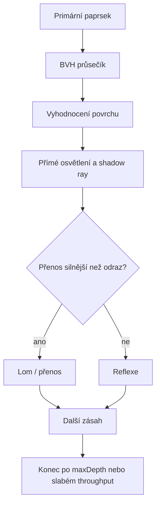

#### Path tracer

`PathTracerRenderer` je v programu skutečně **Monte Carlo path tracer**. Používá náhodné samplování paprsků, branch probability a throughput kompenzaci přes inverzi branch PDF.

V každém bounce se nejdřív odvodí tři pravděpodobnosti:

$$
p_t = transmissionProbability,\qquad
p_s = specProbability,\qquad
p_d = 1 - p_t - p_s
$$

Pak se náhodně volí jedna větev. Throughput se škáluje praktickým Monte Carlo estimátorem:

```math
\mathbf{T}_{k+1} =
\mathbf{T}_{k} \odot \frac{\mathbf{w}_{branch}}{p_{branch}}
```

Difuzní větev používá cosine-weighted hemisphere sampling:

$$
\mathbf{\omega}_{sample} \sim p(\omega) = \frac{\max(0,\mathbf{n}\cdot\omega)}{\pi}
$$

Specular větev vychází z perfektní reflexe a pro nenulovou roughness ji míchá s cosine sample:

$$
\mathbf{\omega}_{spec} = lerp(\mathbf{r},\mathbf{\omega}_{hemi}, roughness)
$$

To je zjednodušený, ale prakticky stabilní model, který odpovídá aktuální implementaci v kódu.

Path tracer navíc dělá explicitní next-event lighting pro všechna směrová a bodová světla. To znamená, že kromě nepřímé stochastické větve v každém zásahu ještě:

- vzorkuje světla přímo,
- vystřelí shadow ray,
- a přičte viditelný přímý příspěvek.

Od třetího bounce dál používá **Russian roulette**:

```math
rr = clamp(\max(T_r,T_g,T_b),\ 0.05,\ 0.98)
```

Paprska buď ukončí s pravděpodobností `1 - rr`, nebo throughput doškáluje:

```math
\mathbf{T} \leftarrow \frac{\mathbf{T}}{rr}
```

To snižuje délku dlouhých drah bez systematického biasu. Přesněji řečeno:

- **Monte Carlo** je hlavní integrační metoda,
- **Russian roulette** je technika ukončování drah uvnitř Monte Carlo integrace.

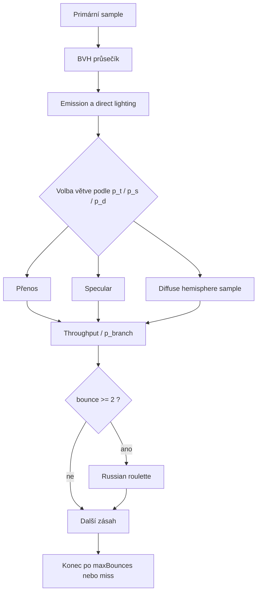

#### Praktický rozdíl mezi renderery

| Oblast | Ray tracer | Path tracer |
| --- | --- | --- |
| Typ integrace | determinističtější větvení | Monte Carlo sampling |
| Odraz / lom | dominantní větev | stochastická volba větve |
| Přímé světlo | explicitně | explicitně + nepřímé sample |
| Throughput/PDF | bez branch PDF kompenzace | branch PDF kompenzace `1 / p_branch` |
| Russian roulette | ne | ano, od `bounce >= 2` |
| Typ použití | rychlejší offline preview | referenční kvalitnější výstup |

### 3. Materiálový preview renderer

Lookdev preview v materiálovém workspace není mini path tracer; používá rychlý analytický preview model s ambient složkou, difuzním osvětlením, specular highlightem a Schlick-like fresnelem:

$$
specTerm = \max(0, \mathbf{n}\cdot\mathbf{h})^{specPow}
$$

$$
fresnel = (1 - \mathbf{n}\cdot\mathbf{v})^5
$$

Pro volume preview používá homogenní směs hustoty a tloušťky:

$$
fog = clamp(density \cdot 0.26 + thickness \cdot 0.08)
$$

### 4. Spray / splash simulace

Experimentální water vrstva je ve skutečnosti deterministický CPU částicový spray. Nepoužívá tlakový solve, PBF ani SPH.

Pro každou částici platí:

$$
\mathbf{v} = \mathbf{v} + \mathbf{g}\cdot gravityScale \cdot dt
$$

$$
\mathbf{v} = \mathbf{v}\cdot e^{-drag \cdot dt}
$$

$$
\mathbf{p} = \mathbf{p} + \mathbf{v}\cdot dt
$$

Podlaha a AABB proxy kolize používají jednoduchý bounce model:

$$
v_{normal} = -v_{normal}\cdot bounce
$$

Tangenciální složky se tlumí přes `surfaceDamping`.

## Materiálový systém

### Source of truth

Materiály jsou graph-driven:

- `MaterialNodeGraph` je authoring source of truth,
- uzly drží své defaulty per-instance,
- inspektor upravuje konkrétní instanci uzlu,
- `PhongMaterial` zůstává jako kompatibilní kontejner pro import a render bridge.

### Hlavní uzly

| Kategorie | Uzly |
| --- | --- |
| Surface | `Principled BSDF`, `Glass BSDF`, `Transparent BSDF`, `Emission`, `Mix Shader` |
| Volume | `Volume Medium` |
| Texture / coord | `Texture Coordinate`, `Mapping`, `Image Texture`, `Normal Map` |
| Utility | `Separate RGB`, `Combine RGB`, `RGB`, `Value`, `Noise Texture`, `Color Ramp`, `Mix Color`, `Math`, `Clamp`, `Map Range` |
| Output | `Output Material` |

### Podpora napříč renderery

| Uzel / oblast | Raster | Ray | Path |
| --- | --- | --- | --- |
| `Principled BSDF` | plně použitelný preview | plně použitelný | plně použitelný |
| `Glass BSDF` | aproximace | plně použitelný | plně použitelný |
| `Transparent BSDF` | aproximace | plně použitelný | plně použitelný |
| `Mix Shader` | aproximovaný výsledný sample | plně použitelný | plně použitelný |
| `Volume Medium` | preview aproximace | částečně | nejvěrnější varianta v programu |
| `Normal Map` | ano | ano | ano |

### Preview a lookdev

Materiálový workspace obsahuje:

- lookdev preview,
- node canvas,
- node inspector,
- prehled podpory rendereru.

Preview podporuje:

| Oblast | Volby |
| --- | --- |
| Primitivum | `Sphere`, `Rounded Cube`, `Plane` |
| Světelný preset | `Studio Soft`, `Hard Rim`, `Warm Sunset`, `Neutral White`, `Dark Contrast` |
| Pozadí | `Dark`, `Gray`, `Checker` |
| Režim preview | `Fast Preview (Raster)`, `Ray Preview`, `Path Preview` |

### PBR texture-set import

Importer rozpoznává role podle názvů souborů:

- `basecolor` / `albedo` / `diffuse`
- `roughness`
- `metallic` / `metalness`
- `metallicroughness`
- `normal`
- `emissive`
- `opacity` / `alpha`
- `ao`

Automaticky staví graph:

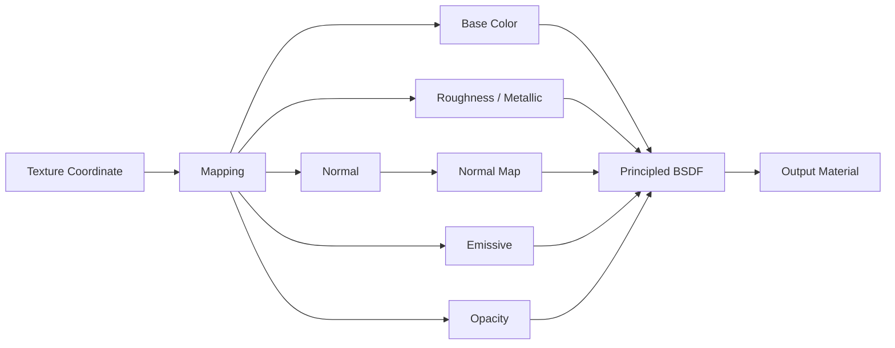

## Temporal Noise

`Temporal Noise` je stylizovaný režim pro motion-defined form. Aktuální implementace je úmyslně úzká a praktická:

- jde o čistý 2D post-process nad hotovým G-bufferem,
- background zůstává statický,
- objekty posouvají stabilní grain po integer mřížce,
- grain se nikdy nedeformuje subpixelovou interpolací,
- zrno lze přepnout mezi `1x1`, `2x2`, `4x4`.

### Přesná pipeline

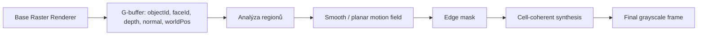

Renderer postupuje takto:

1. `baseRasterRenderer.render(...)` připraví G-buffer.
2. Z `objectId`, `faceId`, `depth`, `normal` a `worldPos` se odvodí regionální motion parametry.
3. Motion field se stabilizuje pro smooth a coplanární plochy.
4. `edgeMask` označí konfliktní přechody.
5. Finální syntéza vykreslí každou grain buňku jednou společnou hodnotou.

To je důležité proto, že velikost zrna neurčuje jen vzhled, ale i skutečnou vykreslovací mřížku. Hrubší preset `4x4` proto negeneruje jemnější subpixely uvnitř buňky.

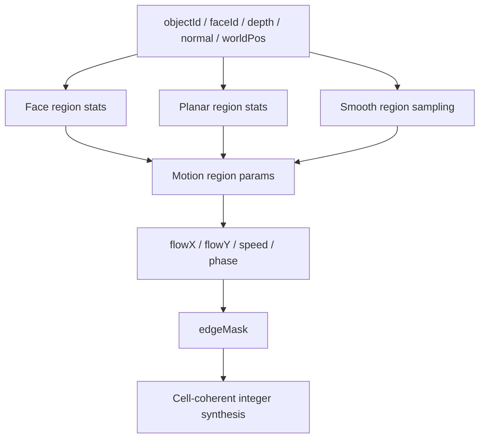

### Regionální směr

Směr regionu vychází z průměrné regionální normály promítnuté do screen-space:

$$
normalScreenX = \mathbf{n}\cdot\mathbf{r}
$$

$$
normalScreenY = -(\mathbf{n}\cdot\mathbf{u})
$$

$$
\mathbf{d}_{2D} = (-normalScreenY,\; normalScreenX)
$$

K tomu se přičítá malý screen-space bias z perspektivní polohy regionu:

```math
desired_x = d_{2D,x} + screenBias_x \cdot signBias
```

```math
desired_y = d_{2D,y} + screenBias_y \cdot signBias
```

Výsledek se pak neotáčí libovolně, ale převádí se do stabilních osových vah `X/Y`. Tím:

- zůstává zrno pevné na mřížce,
- region může běžet po `X`, po `Y` nebo po obou osách současně,
- ale nevzniká subpixelová deformace patternu.

### Regionální rychlost

Aktuální implementace skládá rychlost z blízkosti, šikmého úhlu, kontrastu orientace a malého deterministického regionálního biasu:

```math
grazing = 1 - facing
```

```math
speed =
clamp\left(
0.45 + 1.20 \left(
0.90\,nearContribution\,depthNear +
1.02\,grazingContribution\,grazing +
0.46\,orientationContrast +
c\,perspectiveContrast
\right)
+ regionBias,\;
minSpeed,\;
maxSpeed
\right)
```

`regionBias` je deterministický hash z `objectId`, kvantizované normály, hloubky a screen-space polohy. Tím se snižuje pravděpodobnost, že dvě různé plochy skončí se stejnou osou i stejnou rychlostí.

V implementaci se rychlost ještě kvantizuje do diskrétních pásem. To zmenšuje shimmering mezi sousedními regiony a zlepšuje čitelnost pohybu na složitějších modelech.

### Integer shift a grain

Pro region se počítá diskrétní posuv:

$$
shift(t) = \left\lfloor t \cdot temporalTickRate \cdot speed + phase \right\rfloor
$$

Z něj vznikne společný posuv po `X` a `Y`:

$$
\Delta x = sign_x \cdot round\left(shift \cdot \frac{|w_x|}{\max(|w_x|, |w_y|)}\right)
$$

$$
\Delta y = sign_y \cdot round\left(shift \cdot \frac{|w_y|}{\max(|w_x|, |w_y|)}\right)
$$

Noise se pak čte **bez interpolace** a bez jakéhokoli warpu:

$$
a = random01(cell_x + \Delta x,\; cell_y + \Delta y,\; 0,\; seed_A)
$$

$$
b = random01(cell_x + \Delta x + 17,\; cell_y + \Delta y - 11,\; 0,\; seed_B)
$$

$$
signal = 0.72a + 0.28b
$$

Finální hodnota se kvantizuje do palety `2..8` úrovní a mapuje do rozsahu `28..228`. Finální cell-coherent syntéza navíc používá pro celou grain buňku jednoho reprezentanta, takže:

- `1x1` kreslí pixel po pixelu,
- `2x2` kreslí skutečné `2x2` bloky,
- `4x4` kreslí skutečné `4x4` bloky,
- a nevzniká situace, kdy by uvnitř hrubé buňky vznikly menší spoty.

### Smooth regiony

U smooth objektů se region nebere po samotném `faceId`, ale z lokálního sousedství. Soused je považovaný za kompatibilní pouze pokud:

$$
objectId_i = objectId_j
$$

$$
|depth_i - depth_j| \le 0.015
$$

$$
\mathbf{n}_i \cdot \mathbf{n}_j \ge 0.97
$$

To snižuje polygonální rozpad na koulích a zaoblených modelech, ale ostré hrany zůstávají oddělené. Nad tím ještě běží:

- `smoothCellMotionField(...)` pro vyhlazení mezi kompatibilními smooth buňkami,
- `enforcePlanarRegionConsistency(...)` pro sjednocení coplanárních ploch,
- `normalizeUniformCells(...)` pro zpevnění jednotných grain buněk.

Prakticky to znamená:

- krychle drží jednolitou stěnu,
- koule se méně rozpadají na trojúhelníkové ostrůvky,
- a překrývající se vrstvy se méně slévají.

### Hrany a překryvy

`edgeMask` se staví z rozdílu hloubky, normály a raw flow:

```math
edge = \max\left(
boundary,\;
0.78\,normalTerm + 0.62\,depthTerm + flowTerm
\right)
```

kde:

```math
depthTerm = clamp(|depth_i - depth_j| \cdot 28)
```

```math
flowTerm = clamp\left(\|\Delta flow\| \cdot 0.18\right)
```

Na hraně se neprovádí další blur. Místo toho se jen mírně míchá objektový a background signál:

```math
signal = lerp(objectSignal,\ backgroundSignal,\ blend)
```

```math
blend = clamp(\max(edgeMask \cdot edgeBlendStrength,\ 1-objectCoverage))
```

Tím se omezí tvrdé seam přechody, ale nesmyje se celé zobrazení do měkké mapy.

### Proč je režim relativně levný

`Temporal Noise` je rychlejší než ray/path tracing proto, že:

- reuseuje hotový raster G-buffer,
- neřeší sekundární geometrii ani světelné větvení,
- nepoužívá subpixelový sampling šumu,
- nevzorkuje 3D noise pole,
- a finální pass používá jen integer posuv, dva hash sample kanály a kvantizaci do grayscale palety.

### Aktuální ovladače

| Parametr | Význam |
| --- | --- |
| `Tempo posuvu` | globální rychlost časového kroku |
| `Blízkostní příspěvek` | zesílení rychlosti pro bližší regiony |
| `Příspěvek šikmého úhlu` | zesílení rychlosti pro grazing plochy |
| `Minimální rychlost` | dolní clamp rychlosti regionu |
| `Maximální rychlost` | horní clamp rychlosti regionu |
| `Síla okrajového blendu` | lehký blend objektového a background signálu na hranách |
| `Velikost zrna` | preset `1x1`, `2x2`, `4x4` |
| `Úrovně palety` | počet grayscale úrovní po kvantizaci |

### Debug view

Renderer umí debug pohledy:

- `FINAL`
- `NEUTRAL_BASE`
- `FLOW_FIELD`
- `EDGE_MASK`
- `PHASE_MAP`
- `DEPTH_LAYER`

Tyto pohledy pomáhají kontrolovat:

- osový směr pohybu,
- masku hran,
- regionální fázi,
- depth metriku,
- stabilitu grainu.

## Simulace a experimentální subsystémy

### Spray / splash systém

Program obsahuje scénově navázaný emitter částic:

- částice se spawnují z `WaterEmitterEntity`,
- integrace běží deterministicky na CPU,
- kolize používají podlahu a jednoduché AABB proxy scény,
- runtime i output replay používají shodnou fixed-step logiku.

Vymezení:

- nejde o fluid solver,
- nejde o PBF/SPH,
- nejde o surface reconstruction.

### Galaxy systém

`GalaxySimulation` je aktuálně experimentální scaffold:

- sleduje galaxy entity,
- synchronizuje je se scénou,
- ale neprovádí orbitální nebo N-body simulaci.

## Výstup a export

Output workflow je session-based a oddělené od realtime viewportu.

### Typy exportu

| Typ | Výstup |
| --- | --- |
| Still image | `still.png` nebo `still.jpg` |
| Image sequence | `sequence/frame_0000.png` nebo `.jpg` |
| Animated GIF | `animation.gif` |
| AVI | `animation.avi` jako MJPEG |

### Session složka

Každý job může vytvořit vlastní session složku:

```text
session/
  manifest.json
  preview.png
  log.txt
  still.png / still.jpg
  sequence/frame_0000.png
  animation.gif
  animation.avi
```

### Output pipeline

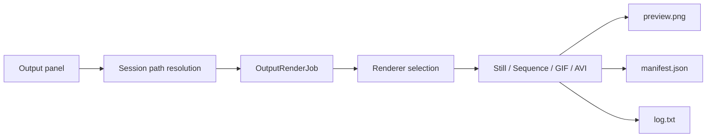

### Co output ukládá

`manifest.json` typicky obsahuje:

- export type,
- renderer,
- rozlišení,
- interní rozlišení,
- sampling / depth volby,
- frame range,
- fps,
- generated files,
- duration,
- cancelled / success stav.

AVI export používá čistě JDK implementaci MJPEG AVI writeru. Program nepoužívá `ffmpeg` ani externí proces.

### Hlavní nastavení output panelu

| Sekce | Nastavení |
| --- | --- |
| Cíl výstupu | základní složka, session folder, timestamp, prefix session |
| Typ výstupu | still, sequence, GIF, AVI |
| Rozsah a časování | use timeline range, start, end, FPS, počet snímků, délka |
| Formát | PNG / JPG, JPG quality, GIF loop, MJPEG quality |
| Renderer výstupu | volba rendereru, převzetí rendereru viewportu, synchronizace output kamery |
| Kvalita a výkon | width, height, internal scale, worker count, tile size, target samples, samples per step, max depth, denoise |
| Specifická nastavení | wireframe, dither, temporal noise, ray/path, hex podle zvoleného režimu |

## UI a workflow editoru

Program drží Blender-like logiku rozvržení, ale zůstává Swing/AWT desktop aplikací.

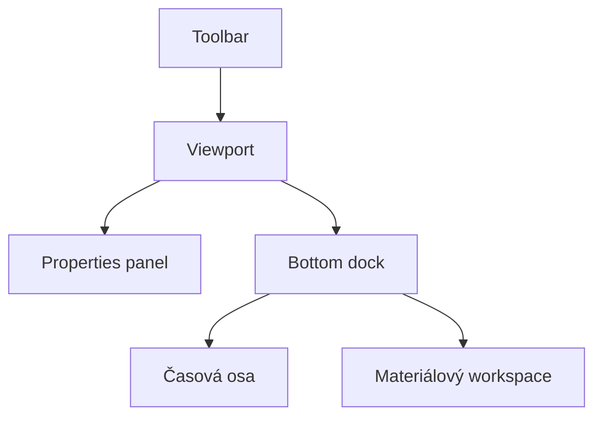


### Hlavní části UI

| Oblast | Funkce |
| --- | --- |
| Toolbar | rychlé render módy, navigace, runtime přepínače |
| Viewport | hlavní pracovní plocha |
| Properties panel | scéna, prostředí, zobrazení, objekt, render, výstup |
| Bottom dock | časová osa a materiálový workspace |
| Materiálový workspace | preview, graph, inspector, summary |

### Pravý panel

Pravý panel obsahuje karty:

- `Scene`
- `World`
- `View`
- `Object`
- `Render`
- `Output`

## Ovládání a zkratky

### Globální editorové zkratky

| Zkratka | Funkce |
| --- | --- |
| `Ctrl+Z` | undo |
| `Ctrl+Shift+Z` / `Ctrl+Y` | redo |
| `Delete` | smazání výběru |
| `Ctrl+D` | duplicate v editorech, kde dává smysl |
| `F` | frame selected |
| `Home` | frame all podle kontextu |
| `Escape` | zrušení transient operace / uvolnění capture |

### Viewport a render režimy

| Klávesa | Funkce |
| --- | --- |
| `G` | `MODEL` |
| `1` | `BASIC` |
| `2` | `PHONG` |
| `3` | `WIREFRAME` |
| `4` | `DITHERING` |
| `5` | `ASCII` styl v ditheringu |
| `6` | `TEMPORAL_NOISE` |
| `7` | `RAY_TRACING` |
| `8` / `0` | `PATH_TRACING` |
| `9` | `HEX_MOSAIC` |
| `Z` | cyklus render módů |
| `F1` nebo <code>`</code> | cyklus dithering stylů |
| `V` | cyklus variant `Temporal Noise` |
| `Ž` | v `Temporal Noise` cyklus grain presetů `1x1 -> 2x2 -> 4x4` |
| `U` | cyklus `Hex` wow stylu |
| `Y` | debug buněk v `Hex` |

### Kamera a navigace

| Zkratka | Funkce |
| --- | --- |
| `Q` | FPS preset navigace |
| `E` | Blender preset navigace |
| `Tab` | cyklus módů kamery |
| `F4` / `O` | perspektiva / ortho |
| `Ctrl+Numpad 1/3/7` | přední / pravý / horní pohled |
| `WASD`, šipky, `Space`, `Ctrl` | pohyb v FPS režimu |
| `MMB`, `Shift+MMB`, kolečko | orbit / pan / zoom v Blender preset režimu |

### Časová osa

| Zkratka | Funkce |
| --- | --- |
| `Space` v Blender preset režimu | play / pause animace |
| `Left`, `Right` | krok po snímcích |
| `Insert` | vložit klíč |
| `Shift+Insert` | smazat klíč |
| `Ctrl+Insert` | vložit klíč pro všechny animovatelné cíle |
| `K` | vložit klíč pro výběr |
| `Shift+K` | release klíč pro fyziku |

### Přidávání a transformace

| Zkratka | Funkce |
| --- | --- |
| `Shift+A` | add menu |
| `C` | cube |
| `S` | sphere |
| `P` | plane |
| `Y` | cylinder |
| `N` | cone (jen při otevřeném add menu) |
| `T` | torus |
| `H` | capsule |
| `R` | pyramid |
| `D` | crystal |
| `K` | torus knot |
| `Alt+G` / `Alt+R` / `Alt+S` | move / rotate / scale |
| `X`, `Y`, `Z` | axis constraint |
| `Enter` | commit transformace |

### Runtime a systém

| Zkratka | Funkce |
| --- | --- |
| `F5` | frustum culling |
| `F6` | backface culling |
| `F7` | physics |
| `F8` | auto rotate demo |
| `F9` | paralelní raster |
| `F10` | render scale |
| `F11`, `F12` | worker count - / + |
| `PgDown`, `PgUp` | samples per frame - / + |
| `F2` | upscale filter |
| `F3` | post AA |
| `B` | debug overlay |
| `N` | editor overlay (globálně; při otevřeném add menu zároveň potvrdí `cone`) |
| `H` | help |

## Import, primitiva a asset workflow

### Import

Podporované importy:

- `OBJ`
- `STL`
- `glTF`
- `GLB`
- `FBX` v UI filtru, ale bez čistě Java importeru

### Primitiva

Uživatelsky dostupná primitiva z add menu:

- cube
- sphere
- plane
- cylinder
- cone
- prism
- torus
- capsule
- pyramid
- crystal
- torus knot

### Asset workflow

- `OBJ` může doplnit diffúzní texturu z doprovodného souboru.
- PBR texture set import sestaví graph automaticky.
- Materiálový graph a `PhongMaterial` se synchronizují přes kompatibilní bridge tam, kde to renderery potřebují.

## Build, spuštění a testy

Primární build a test workflow nepoužívá Maven ani Gradle. Repo ale obsahuje lehké `pom.xml` jen jako stabilní IDE/classpath metadata pro Java language server; oficiální build a testy dál běží čistě nad JDK skripty.

### Požadavky

- `JDK 17+`
- `PATH` nebo `JAVA_HOME`

### Windows / PowerShell

```powershell
.\build.ps1
.\build.ps1 -Run
```

### Windows offline installer

```powershell
.\package.ps1 -Version vX.Y.Z
```

Script vytvoří jednosouborový offline Windows installer `.exe`, který v sobě nese vlastní Java runtime, potřebné `assets` a po instalaci se chová jako běžný desktop program se zástupci a odinstalací. Do `build/package/` ukládá jen finální instalačku.

Během buildu se zároveň ověří:
- zabalená aplikace přes `--help`
- zabalená aplikace přes `--package-smoke`
- tichá instalace installeru do izolované testovací cesty
- vytvoření zástupců a uninstall záznamu
- spuštění instalované appky přes asset smoke
- tichá odinstalace a úklid po ní

### Linux / macOS / Git Bash

```bash
./build.sh
./build.sh --run
```

### Testy

```powershell
.\tests\run-tests.ps1
```

```bash
./tests/run-tests.sh
```

### Reprodukce README statistik a benchmarků

```powershell
.\tests\run-project-metrics.ps1 -BenchmarkMode full
```

```bash
./tests/run-project-metrics.sh full
```

Build skripty kompilují projekt do lokální ignorované složky `build/`. Test runner kompiluje hlavní zdrojáky a testy odděleně, takže nezávisí na starých `out/` nebo `out_tests/` artefaktech. `BenchmarkMode` podporuje `quick`, `standard` a `full`; README benchmark tabulky jsou vygenerované z `full`.

## Struktura repozitáře

```text
src/
  engine/
    core/        editor, UI controllery, output workflow, history, hotkeys
    render/      raster, ray, path a stylizované renderery
    material/    materiály, node graph, preview, texture-set import
    scene/       entity, světla, scéna
    sim/         experimentální simulace
    io/          import modelů a parsování
    ui/          theme, strings, layout utility
tests/           regresní a smoke testy
docs/            doplňková technická dokumentace a README assety
assets/          modely, ikony a další data projektu
build/           lokální build artefakty
```

## Omezení a skutečný stav projektu

### Stabilní vrstvy

- editorové UI a základní workflow
- raster viewport
- ray tracer
- path tracer
- materiálový graph foundation
- output workflow a session export

### Pokročilé, ale stále studentské části

- glass / transmission workflow
- homogenní volume
- materiálový preview renderer
- AVI export přes MJPEG writer
- `Temporal Noise` a další stylizované režimy

### Experimentální části

- spray / splash částice
- galaxy scaffold
- některé stylizované režimy jako výzkumná vrstva

### Známá omezení

- vše běží na CPU
- raster preview není fyzikálně referenční renderer
- volume je homogenní a zjednodušené
- některé closure kombinace mají nejlepší interpretaci až v ray/path režimech
- simulace nejsou všechny na stejné úrovni maturity

## Další technická dokumentace

Tato README verze drží důležité technické informace přímo na hlavní stránce repozitáře, aby nebylo nutné přecházet do files zobrazení.

| Dokumentační oblast | Co je zahrnuto zde |
| --- | --- |
| Architektura | modulární členění, odpovědnosti balíků, runtime workflow |
| Rendering | přehled režimů, pipeline, matematické jádro, výkonové charakteristiky |
| Materiály | graph workflow, evaluace uzlů, mapování textur a closure |
| Output | export režimy, metadata, session struktura a benchmark exportu |
| Roadmap témata | materiály, water částice, galaxy scaffold |
| Java CPU denoiser | inference pravidla, tensor layout, tiled postup |

[^bench]: Benchmark tabulky jsou navázané na test runner skripty a mají reprodukovatelné workflow v sekci Build, spuštění a testy.

---

