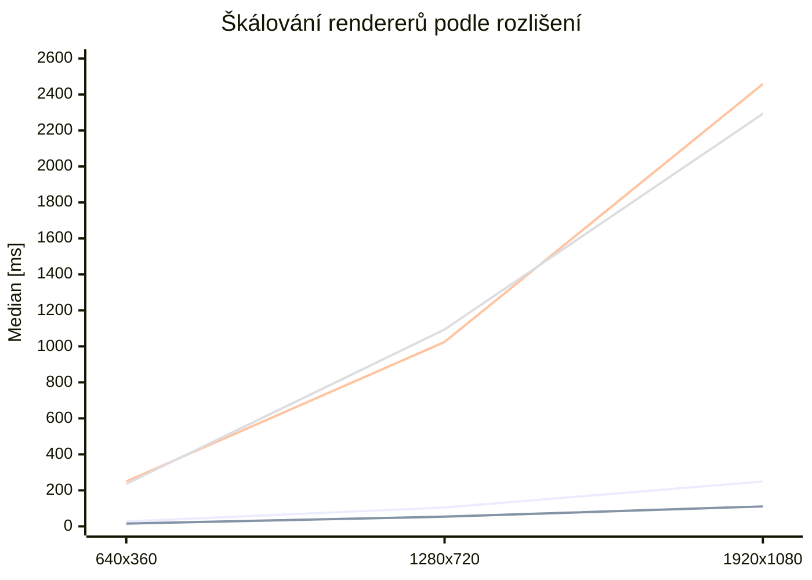
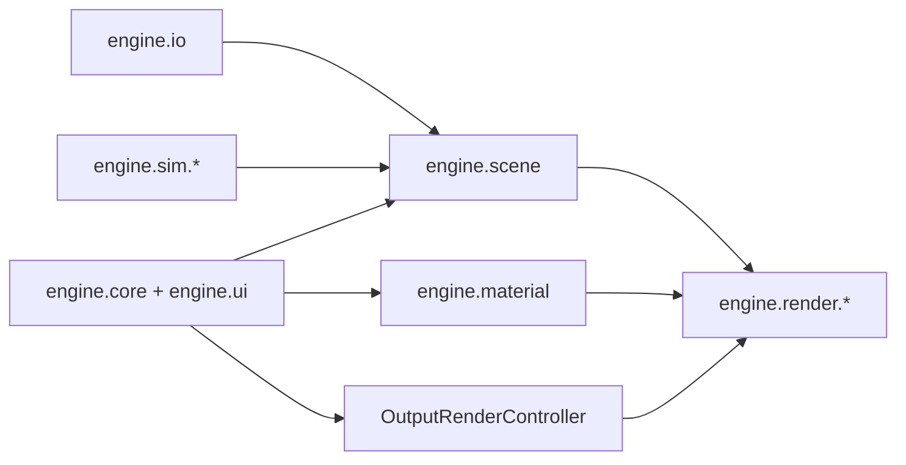
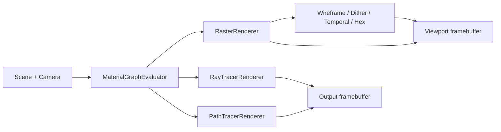
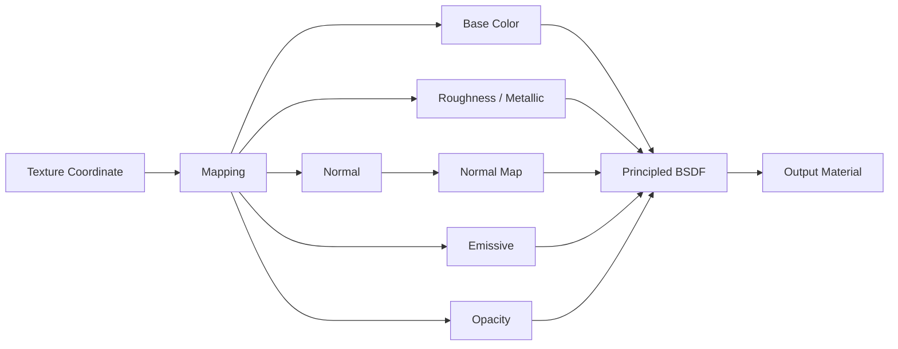
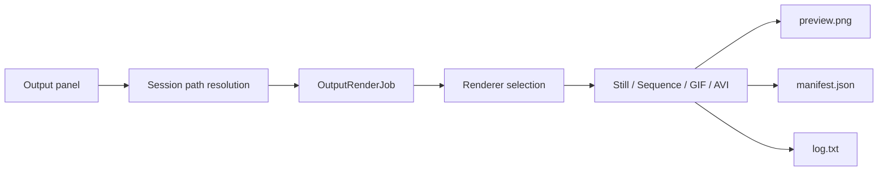
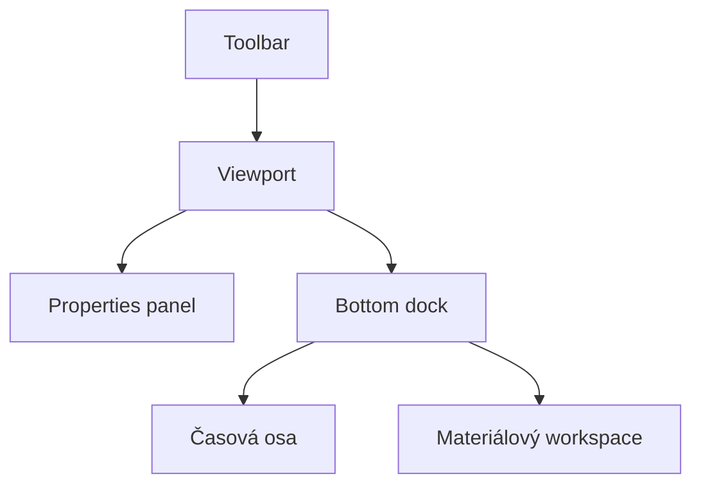

# 3D Render Physics


Čistě Java desktop editor a render sandbox zaměřený na počítačovou grafiku, CPU renderery, node-based materiály, editorové workflow a experimentální stylizované režimy. Program je navržený jako technický studentský projekt z grafiky: nesnaží se imitovat produkční DCC nebo produkční render engine, ale propojuje větší množství grafických subsystémů do jednoho konzistentního celku.

## Autor

**Jiří Pelikán**

## Obsah

- [Rychlý přehled](#rychlý-přehled)
- [Tvrdá data a ověřené statistiky](#tvrdá-data-a-ověřené-statistiky)
- [Co program aktuálně umí](#co-program-aktuálně-umí)
- [Architektura programu](#architektura-programu)
- [Renderery a stylizované režimy](#renderery-a-stylizované-režimy)
- [Matematické jádro](#matematické-jádro)
- [Materiálový systém](#materiálový-systém)
- [Temporal Noise](#temporal-noise)
- [Simulace a experimentální subsystémy](#simulace-a-experimentální-subsystémy)
- [Výstup a export](#výstup-a-export)
- [UI a workflow editoru](#ui-a-workflow-editoru)
- [Ovládání a zkratky](#ovládání-a-zkratky)
- [Import, primitiva a asset workflow](#import-primitiva-a-asset-workflow)
- [Build, spuštění a testy](#build-spuštění-a-testy)
- [Struktura repozitáře](#struktura-repozitáře)
- [Omezení a skutečný stav projektu](#omezení-a-skutečný-stav-projektu)
- [Další technická dokumentace](#další-technická-dokumentace)

## Rychlý přehled

| Oblast | Stav | Poznámka |
| --- | --- | --- |
| Editorové UI | stabilní | Swing/AWT, Blender-like layout |
| Raster viewport | stabilní | rychlé preview a stylizované módy |
| Ray tracer | stabilní | CPU offline renderer s BVH, stíny, odrazy a přenosem |
| Path tracer | stabilní | referenční CPU renderer pro lookdev a finální výstup |
| Materiálový graph | pokročilý | `MaterialNodeGraph` je authoring source of truth |
| Output workflow | stabilní | still / sequence / GIF / AVI (MJPEG), session folders |
| Spray / splash částice | experimentální | částicový overlay, ne fluid solver |
| Galaxy systém | experimentální scaffold | bez orbitálního nebo N-body solveru |


> Program je poctivě rozdělený na stabilní vrstvy, použitelné pokročilé části a experimentální subsystémy. README záměrně nepřipisuje programu chování, které kód ve skutečnosti neumí.

## Tvrdá data a ověřené statistiky

Tato sekce shrnuje čísla ověřená přímo nad aktuální codebase a referenční headless benchmarky vygenerované runnerem `tests/run-project-metrics.ps1` nebo `tests/run-project-metrics.sh`.

### Statistika codebase

| Metrika | Hodnota |
| --- | ---: |
| Java soubory v `src` | 202 |
| Neblank Java řádky v `src` | 45 388 |
| Java soubory v `tests` | 34 |
| Neblank Java řádky v `tests` | 5 414 |
| Automatické test suite entry pointy | 24 |
| Render módy | 9 |
| Node typy materiálového graphu | 24 |
| Materiálové presety | 9 |
| Preview primitiva | 3 |
| Preview lighting presety | 5 |
| Preview background režimy | 3 |
| Preview render režimy | 3 |
| Typy exportu | 4 |
| Základní primitiva | 9 |
| Featured primitiva | 2 |

### Import / export data

| Oblast | Aktuální stav |
| --- | --- |
| Import filtr v UI | `OBJ`, `STL`, `glTF`, `GLB`, `FBX` |
| Nativně obsloužené import cesty | `OBJ`, `STL`, `glTF`, `GLB` |
| FBX větev | filtr existuje, ale čistě Java importer ji má jako unsupported |
| Výstupní typy | `STILL`, `IMAGE_SEQUENCE`, `ANIMATED_GIF`, `ANIMATED_AVI` |
| Session artefakty | `manifest.json`, `preview.png`, `log.txt` |

### Rozdělení automatických testů

| Kategorie | Počet suite entry pointů |
| --- | ---: |
| Rendering | 9 |
| Materiály | 3 |
| Import / IO | 5 |
| Editor / core | 4 |
| Kvalita / prezentace | 2 |
| Ostatní | 1 |

### Benchmark scéna a transparentní parametry

| Parametr | Hodnota |
| --- | --- |
| Java runtime | `17.0.9` / `Java HotSpot(TM) 64-Bit Server VM` |
| OS | Windows 11 / `amd64` |
| Logické procesory | `24` |
| Benchmark scéna | `4` mesh entity, `2` směrová světla |
| Celkový počet trojúhelníků | `886` |
| Kamera | perspective, `FOV 60°`, pozice `(0.0, 0.5, 4.4)`, `lookAt (0.0, -0.15, 0.0)` |
| Rozlišení scaling testu | `640x360`, `1280x720`, `1920x1080` |
| Render benchmark režim | single-worker, headless |
| Render benchmark passy | `2` nezávislé passy × `3` měřené běhy |
| Referenční pracovní benchmark | `3` nezávislé passy × `5` měřených běhů |
| Export benchmark zdroj | `8` předpřipravených PHONG frameů na daném rozlišení |
| Export benchmark formáty | `PNG still`, `JPG still`, `PNG sequence`, `GIF`, `AVI MJPEG` |
| JPG kvalita | `0.92` |
| GIF | `8` snímků, `24 FPS`, loop forever |
| AVI | `8` snímků, `24 FPS`, MJPEG quality `0.90` |

### Referenční pracovní benchmark rendererů

| Renderer | Rozlišení | Passy × běhy | Min [ms] | Median [ms] | Mean [ms] | Max [ms] |
| --- | ---: | ---: | ---: | ---: | ---: | ---: |
| Raster / PHONG | 256x256 | 3 × 5 | 6.45 | 6.59 | 7.14 | 9.98 |
| Dithering | 256x256 | 3 × 5 | 7.11 | 7.24 | 7.38 | 8.94 |
| Temporal Noise | 256x256 | 3 × 5 | 3.44 | 3.58 | 4.78 | 9.80 |
| Hex Mosaic | 256x256 | 3 × 5 | 2.29 | 2.34 | 2.62 | 4.96 |
| Ray Tracing | 96x96 | 3 × 5 | 8.97 | 9.12 | 9.32 | 11.32 |
| Path Tracing | 96x96 | 3 × 5 | 7.94 | 8.31 | 8.61 | 10.82 |

### Škálování výkonu podle rozlišení



| Renderer | 640x360 median [ms] | 1280x720 median [ms] | 1920x1080 median [ms] | Poměr 1080p / 360p |
| --- | ---: | ---: | ---: | ---: |
| Raster / PHONG | 21.50 | 87.76 | 240.19 | 11.17× |
| Temporal Noise | 10.89 | 47.42 | 98.95 | 9.09× |
| Ray Tracing | 281.40 | 1068.07 | 2346.18 | 8.34× |
| Path Tracing | 243.75 | 1023.40 | 2279.00 | 9.35× |

### Export benchmark podle formátu a rozlišení

Tato tabulka měří čistě zápis formátu nad připravenými snímky. Nejde tedy o plný čas `render + export`, ale o samotnou náročnost export pipeline pro jednotlivé formáty.

| Formát | 640x360 median [ms] | 640x360 velikost | 1280x720 median [ms] | 1280x720 velikost | 1920x1080 median [ms] | 1920x1080 velikost |
| --- | ---: | ---: | ---: | ---: | ---: | ---: |
| PNG still | 17.38 | 0.02 MB | 21.42 | 0.08 MB | 76.64 | 0.20 MB |
| JPG still | 15.25 | 0.01 MB | 12.11 | 0.02 MB | 31.35 | 0.04 MB |
| PNG sequence | 103.21 | 0.12 MB | 223.29 | 0.62 MB | 456.13 | 1.64 MB |
| GIF | 181.67 | 0.31 MB | 715.20 | 0.91 MB | 1764.13 | 1.87 MB |
| AVI MJPEG | 55.12 | 0.06 MB | 148.88 | 0.18 MB | 282.23 | 0.35 MB |

> Benchmark tabulka je určená jako reprodukovatelný referenční údaj pro tento repozitář, ne jako absolutní srovnání s jinými enginy. Smysl tabulky je ukázat relativní náklad jednotlivých rendererů v rámci stejného projektu a stejné malé scény.

## Co program aktuálně umí

- Blender-like rozložení editoru: toolbar nahoře, viewport uprostřed, properties vpravo, spodní workspace dock.
- Software raster renderer pro rychlý viewport.
- CPU `RayTracerRenderer` a `PathTracerRenderer`.
- Stylizované režimy `Wireframe`, `Dithering`, `Temporal Noise` a `Hex Mosaic`.
- Materiálový workspace s node graph editorem, preview panelem a inspektorem uzlů.
- Sdílené materiálové vyhodnocení napříč raster/ray/path renderery.
- Import modelů `OBJ`, `STL`, `glTF`, `GLB`, `FBX`.
- Output workflow pro statický snímek, sekvenci, GIF a AVI (MJPEG) bez externích nástrojů.
- Session-based export s `manifest.json`, `preview.png`, `log.txt` a oddělenými session složkami.
- Časovou osu, klíčování a základní editorovou historii.
- Experimentální spray/splash emitter a scaffold pro galaxy systém.

## Architektura programu

Program používá modulární rozdělení podle odpovědností:



### Praktické členění

- `engine.core`
  - lifecycle aplikace,
  - toolbar, properties, docky,
  - history, shortcut routing, output workflow.
- `engine.render`
  - raster renderer,
  - ray tracer,
  - path tracer,
  - stylizované post/styl renderery.
- `engine.material`
  - `PhongMaterial` jako kompatibilní obálka,
  - `MaterialNodeGraph` jako authoring source of truth,
  - evaluace graphu, preview, texture-set import.
- `engine.scene`
  - entity, světla, transformace, scéna.
- `engine.sim`
  - experimentální simulace a overlay subsystémy.
- `engine.io`
  - import modelů a parsování souborových formátů.

## Renderery a stylizované režimy

### Přehled render režimů

| Režim | Implementace | Účel | Rychlost | Poznámka |
| --- | --- | --- | --- | --- |
| `MODEL` | lehký raster preview | blokování tvaru a navigace | velmi vysoká | bez plného materiálového výsledku |
| `BASIC` | jednoduchý raster | rychlý layout | vysoká | základní barevný náhled |
| `PHONG` | hlavní viewport raster | běžná práce ve viewportu | vysoká | hlavní realtime preview |
| `WIREFRAME` | stylizovaný edge renderer | kontrola topologie a siluet | vysoká | volitelné skryté hrany / silueta |
| `DITHERING` | post styl | stylizovaný obraz | střední | styly `BLUE_NOISE`, `PATTERN`, `ASCII` |
| `TEMPORAL_NOISE` | post styl nad G-bufferem | motion-defined forma z pohybu šumu | střední | integer 2D grain, regionální posuv |
| `HEX_MOSAIC` | post styl | stylizovaná hex mozaika | střední | buňka, outline, theme |
| `RAY_TRACING` | CPU ray tracer | kvalitnější offline preview | nižší | stíny, odrazy, přenos |
| `PATH_TRACING` | CPU path tracer | referenční lookdev / finální výstup | nejnižší | nejvěrnější interpretace materiálů |

### Raster vs. Ray vs. Path

| Oblast | Raster | Ray | Path |
| --- | --- | --- | --- |
| Surface shading | preview aproximace | silná interpretace | referenční interpretace |
| Glass / transmission | omezená aproximace | použitelná | nejlepší varianta v projektu |
| Transparent BSDF | aproximace | použitelný | použitelný |
| Volume medium | homogenní preview aproximace | omezené homogenní médium | nejlepší homogenní médium v projektu |
| Normal map | ano | ano | ano |
| Mix Shader | aproximovaný sample | smysluplné closure mixing | smysluplné closure mixing |

### Hlavní render nastavení v UI

| Oblast | Nastavení |
| --- | --- |
| Globální viewport | frustum culling, backface culling, paralelní raster, post AA, progresivní viewport, culling podle vzdálenosti, fallback režim, cílové FPS, render scale, počet vláken |
| Wireframe | hloubkově skryté hrany, zvýraznění siluety, přerušované hrany |
| Dither | styl, počet tónů, kontrast, velikost buňky, invert, ASCII znaková sada |
| Temporal Noise | tempo posuvu, blízkostní příspěvek, příspěvek šikmého úhlu, minimální rychlost, maximální rychlost, síla okrajového blendu, velikost zrna, úrovně palety |
| Hex Mosaic | velikost buňky, kvantizace, outline, wow strength, theme, edge aware, škálování vzdáleností, debug buněk |
| Ray Tracing | vzorky / snímek, tile size, diffuse/glossy/transmission/volume/transparent depth, přímé světlo, stíny, odrazy, denoise |
| Path Tracing | vzorky / snímek, tile size, diffuse/glossy/transmission/volume/transparent depth, přímé světlo, obloha, denoise |

### Render pipeline



## Matematické jádro

Tato sekce shrnuje hlavní matematické vztahy, které program skutečně používá nebo které přímo odpovídají aktuální implementaci.

### 1. Transformace vrcholů

Raster větev převádí vrcholy přes modelovou, view a projekční transformaci do clip prostoru a potom do `NDC` a screen-space:

$$
\mathbf{p}_{world} = M \cdot \begin{bmatrix}x \\ y \\ z \\ 1\end{bmatrix}
$$

$$
\mathbf{p}_{clip} = VP \cdot \mathbf{p}_{world}
$$

$$
\mathbf{p}_{ndc} = \frac{\mathbf{p}_{clip.xyz}}{w_{clip}}
$$

$$
x_{screen} = \left(\frac{x_{ndc}}{2} + \frac{1}{2}\right)(W-1), \qquad
y_{screen} = \left(1 - \left(\frac{y_{ndc}}{2} + \frac{1}{2}\right)\right)(H-1)
$$

World-space normály se transformují přes `normalMatrix`, tj. horní levou `3x3` část inverse-transpose modelové matice.

### 2. Ray tracer a path tracer

Oba offline renderery používají akceleraci přes BVH a drží průchod paprsku ve standardním tvaru:

$$
\mathbf{r}(t) = \mathbf{o} + t\mathbf{d}
$$

Path tracer i ray tracer drží barevný throughput:

$$
\mathbf{T}_{k+1} = \mathbf{T}_{k} \odot \mathbf{w}_{branch}
$$

Radiance se skládá z emisí, přímého světla a dalších větví:

$$
\mathbf{L} = \sum_k \mathbf{T}_k \odot \left(\mathbf{L}_{direct,k} + \mathbf{L}_{emission,k}\right)
$$

Path tracer po několika bounce používá Russian roulette, zatímco ray tracer drží determinističtější větvení s omezenou hloubkou.

### 3. Materiálový preview renderer

Lookdev preview v materiálovém workspace není mini path tracer; používá rychlý analytický preview model s ambient složkou, difuzním osvětlením, specular highlightem a Schlick-like fresnelem:

$$
specTerm = \max(0, \mathbf{n}\cdot\mathbf{h})^{specPow}
$$

$$
fresnel = (1 - \mathbf{n}\cdot\mathbf{v})^5
$$

Pro volume preview používá homogenní směs hustoty a tloušťky:

$$
fog = clamp(density \cdot 0.26 + thickness \cdot 0.08)
$$

### 4. Temporal Noise

`TemporalNoiseRenderer` je v aktuální verzi čistý 2D post-process nad G-bufferem. Nepoužívá subpixelovou advekci, diagonální blur ani deformaci grainu. Všechen pohyb vzniká pouze integer posuvem stabilní 2D noise mřížky.

#### Regionální směr

Směr regionu vychází z průměrné regionální normály promítnuté do screen-space:

$$
normalScreenX = \mathbf{n}\cdot\mathbf{r}
$$

$$
normalScreenY = -(\mathbf{n}\cdot\mathbf{u})
$$

$$
\mathbf{d}_{2D} = (-normalScreenY,\; normalScreenX)
$$

K tomu se přičítá malý screen-space bias z perspektivní polohy regionu a výsledek se kvantizuje do osových vah `X/Y`.

#### Regionální rychlost

Aktuální implementace skládá rychlost z blízkosti, šikmého úhlu, kontrastu orientace a malého deterministického regionálního biasu:

$$
grazing = 1 - facing
$$

$$
speed = clamp\left(
0.45 + 1.20 \cdot
\left(
nearContribution \cdot depthNear \cdot 0.90 +
grazingContribution \cdot grazing \cdot 1.02 +
orientationContrast \cdot 0.46 +
perspectiveContrast \cdot c
\right)
 + regionBias,\;
minSpeed,\;
maxSpeed
\right)
$$

`regionBias` je deterministický hash z `objectId`, kvantizované normály, hloubky a screen-space polohy. Tím se snižuje pravděpodobnost, že dvě různé plochy skončí se stejnou osou i stejnou rychlostí.

#### Integer shift a grain

Pro region se počítá diskrétní posuv:

$$
shift(t) = \left\lfloor t \cdot temporalTickRate \cdot speed + phase \right\rfloor
$$

Z něj vznikne společný posuv po `X` a `Y`:

$$
\Delta x = sign_x \cdot round\left(shift \cdot \frac{|w_x|}{\max(|w_x|, |w_y|)}\right)
$$

$$
\Delta y = sign_y \cdot round\left(shift \cdot \frac{|w_y|}{\max(|w_x|, |w_y|)}\right)
$$

Noise se pak čte bez interpolace:

$$
a = random01(cell_x + \Delta x,\; cell_y + \Delta y,\; 0,\; seed_A)
$$

$$
b = random01(cell_x + \Delta x + 17,\; cell_y + \Delta y - 11,\; 0,\; seed_B)
$$

$$
signal = 0.72a + 0.28b
$$

Finální hodnota se kvantizuje do palety `2..8` úrovní a mapuje do rozsahu `28..228`.

#### Smooth regiony

U smooth objektů se region nebere po samotném `faceId`, ale z lokálního sousedství. Soused je považovaný za kompatibilní pouze pokud:

$$
objectId_i = objectId_j
$$

$$
|depth_i - depth_j| \le 0.015
$$

$$
\mathbf{n}_i \cdot \mathbf{n}_j \ge 0.97
$$

To snižuje polygonální rozpad na koulích a zaoblených modelech, ale ostré hrany zůstávají oddělené.

### 5. Spray / splash simulace

Experimentální water vrstva je ve skutečnosti deterministický CPU částicový spray. Nepoužívá tlakový solve, PBF ani SPH.

Pro každou částici platí:

$$
\mathbf{v} = \mathbf{v} + \mathbf{g}\cdot gravityScale \cdot dt
$$

$$
\mathbf{v} = \mathbf{v}\cdot e^{-drag \cdot dt}
$$

$$
\mathbf{p} = \mathbf{p} + \mathbf{v}\cdot dt
$$

Podlaha a AABB proxy kolize používají jednoduchý bounce model:

$$
v_{normal} = -v_{normal}\cdot bounce
$$

Tangenciální složky se tlumí přes `surfaceDamping`.

## Materiálový systém

### Source of truth

Materiály jsou graph-driven:

- `MaterialNodeGraph` je authoring source of truth,
- uzly drží své defaulty per-instance,
- inspektor upravuje konkrétní instanci uzlu,
- `PhongMaterial` zůstává jako kompatibilní kontejner pro import a render bridge.

### Hlavní uzly

| Kategorie | Uzly |
| --- | --- |
| Surface | `Principled BSDF`, `Glass BSDF`, `Transparent BSDF`, `Emission`, `Mix Shader` |
| Volume | `Volume Medium` |
| Texture / coord | `Texture Coordinate`, `Mapping`, `Image Texture`, `Normal Map` |
| Utility | `Separate RGB`, `Combine RGB`, `RGB`, `Value`, `Noise Texture`, `Color Ramp`, `Mix Color`, `Math`, `Clamp`, `Map Range` |
| Output | `Output Material` |

### Podpora napříč renderery

| Uzel / oblast | Raster | Ray | Path |
| --- | --- | --- | --- |
| `Principled BSDF` | plně použitelný preview | plně použitelný | plně použitelný |
| `Glass BSDF` | aproximace | plně použitelný | plně použitelný |
| `Transparent BSDF` | aproximace | plně použitelný | plně použitelný |
| `Mix Shader` | aproximovaný výsledný sample | plně použitelný | plně použitelný |
| `Volume Medium` | preview aproximace | částečně | nejvěrnější varianta v programu |
| `Normal Map` | ano | ano | ano |

### Preview a lookdev

Materiálový workspace obsahuje:

- lookdev preview,
- node canvas,
- node inspector,
- shrnutí podpory rendererů.

Preview podporuje:

| Oblast | Volby |
| --- | --- |
| Primitivum | `Sphere`, `Rounded Cube`, `Plane` |
| Světelný preset | `Studio Soft`, `Hard Rim`, `Warm Sunset`, `Neutral White`, `Dark Contrast` |
| Pozadí | `Dark`, `Gray`, `Checker` |
| Režim preview | `Fast Preview (Raster)`, `Ray Preview`, `Path Preview` |

### PBR texture-set import

Importer rozpoznává role podle názvů souborů:

- `basecolor` / `albedo` / `diffuse`
- `roughness`
- `metallic` / `metalness`
- `metallicroughness`
- `normal`
- `emissive`
- `opacity` / `alpha`
- `ao`

Automaticky staví graph:



## Temporal Noise

`Temporal Noise` je stylizovaný režim pro motion-defined form. Aktuální implementace je úmyslně úzká a praktická:

- jde o čistý 2D post-process nad hotovým G-bufferem,
- background zůstává statický,
- objekty posouvají stabilní grain po integer mřížce,
- grain se nikdy nedeformuje subpixelovou interpolací,
- zrno lze přepnout mezi `1x1`, `2x2`, `4x4`.

### Aktuální ovladače

| Parametr | Význam |
| --- | --- |
| `Tempo posuvu` | globální rychlost časového kroku |
| `Blízkostní příspěvek` | zesílení rychlosti pro bližší regiony |
| `Příspěvek šikmého úhlu` | zesílení rychlosti pro grazing plochy |
| `Minimální rychlost` | dolní clamp rychlosti regionu |
| `Maximální rychlost` | horní clamp rychlosti regionu |
| `Síla okrajového blendu` | lehký blend objektového a background signálu na hranách |
| `Velikost zrna` | preset `1x1`, `2x2`, `4x4` |
| `Úrovně palety` | počet grayscale úrovní po kvantizaci |

### Debug view

Renderer umí debug pohledy:

- `FINAL`
- `NEUTRAL_BASE`
- `FLOW_FIELD`
- `EDGE_MASK`
- `PHASE_MAP`
- `DEPTH_LAYER`

Tyto pohledy pomáhají kontrolovat:

- osový směr pohybu,
- masku hran,
- regionální fázi,
- depth metriku,
- stabilitu grainu.

## Simulace a experimentální subsystémy

### Spray / splash systém

Program obsahuje scénově navázaný emitter částic:

- částice se spawnují z `WaterEmitterEntity`,
- integrace běží deterministicky na CPU,
- kolize používají podlahu a jednoduché AABB proxy scény,
- runtime i output replay používají shodnou fixed-step logiku.

Poctivé vymezení:

- nejde o fluid solver,
- nejde o PBF/SPH,
- nejde o surface reconstruction.

### Galaxy systém

`GalaxySimulation` je aktuálně experimentální scaffold:

- sleduje galaxy entity,
- synchronizuje je se scénou,
- ale neprovádí orbitální nebo N-body simulaci.

## Výstup a export

Output workflow je session-based a oddělené od realtime viewportu.

### Typy exportu

| Typ | Výstup |
| --- | --- |
| Still image | `still.png` nebo `still.jpg` |
| Image sequence | `sequence/frame_0000.png` nebo `.jpg` |
| Animated GIF | `animation.gif` |
| AVI | `animation.avi` jako MJPEG |

### Session složka

Každý job může vytvořit vlastní session složku:

```text
session/
  manifest.json
  preview.png
  log.txt
  still.png / still.jpg
  sequence/frame_0000.png
  animation.gif
  animation.avi
```

### Output pipeline



### Co output ukládá

`manifest.json` typicky obsahuje:

- export type,
- renderer,
- rozlišení,
- interní rozlišení,
- sampling / depth volby,
- frame range,
- fps,
- generated files,
- duration,
- cancelled / success stav.

AVI export používá čistě JDK implementaci MJPEG AVI writeru. Program nepoužívá `ffmpeg` ani externí proces.

### Hlavní nastavení output panelu

| Sekce | Nastavení |
| --- | --- |
| Cíl výstupu | základní složka, session folder, timestamp, prefix session |
| Typ výstupu | still, sequence, GIF, AVI |
| Rozsah a časování | use timeline range, start, end, FPS, počet snímků, délka |
| Formát | PNG / JPG, JPG quality, GIF loop, MJPEG quality |
| Renderer výstupu | volba rendereru, převzetí rendereru viewportu, synchronizace output kamery |
| Kvalita a výkon | width, height, internal scale, worker count, tile size, target samples, samples per step, max depth, denoise |
| Specifická nastavení | wireframe, dither, temporal noise, ray/path, hex podle zvoleného režimu |

## UI a workflow editoru

Program drží Blender-like logiku rozvržení, ale zůstává Swing/AWT desktop aplikací.




### Hlavní části UI

| Oblast | Funkce |
| --- | --- |
| Toolbar | rychlé render módy, navigace, runtime přepínače |
| Viewport | hlavní pracovní plocha |
| Properties panel | scéna, prostředí, zobrazení, objekt, render, výstup |
| Bottom dock | časová osa a materiálový workspace |
| Materiálový workspace | preview, graph, inspector, summary |

### Pravý panel

Pravý panel obsahuje karty:

- `Scene`
- `World`
- `View`
- `Object`
- `Render`
- `Output`

## Ovládání a zkratky

### Globální editorové zkratky

| Zkratka | Funkce |
| --- | --- |
| `Ctrl+Z` | undo |
| `Ctrl+Shift+Z` / `Ctrl+Y` | redo |
| `Delete` | smazání výběru |
| `Ctrl+D` | duplicate v editorech, kde dává smysl |
| `F` | frame selected |
| `Home` | frame all podle kontextu |
| `Escape` | zrušení transient operace / uvolnění capture |

### Viewport a render režimy

| Klávesa | Funkce |
| --- | --- |
| `G` | `MODEL` |
| `1` | `BASIC` |
| `2` | `PHONG` |
| `3` | `WIREFRAME` |
| `4` | `DITHERING` |
| `5` | `ASCII` styl v ditheringu |
| `6` | `TEMPORAL_NOISE` |
| `7` | `RAY_TRACING` |
| `8` / `0` | `PATH_TRACING` |
| `9` | `HEX_MOSAIC` |
| `Z` | cyklus render módů |
| `F1` nebo <code>`</code> | cyklus dithering stylů |
| `V` | cyklus variant `Temporal Noise` |
| `Ž` | v `Temporal Noise` cyklus grain presetů `1x1 -> 2x2 -> 4x4` |
| `U` | cyklus `Hex` wow stylu |
| `Y` | debug buněk v `Hex` |

### Kamera a navigace

| Zkratka | Funkce |
| --- | --- |
| `Q` | FPS preset navigace |
| `E` | Blender preset navigace |
| `Tab` | cyklus módů kamery |
| `F4` / `O` | perspektiva / ortho |
| `Ctrl+Numpad 1/3/7` | přední / pravý / horní pohled |
| `WASD`, šipky, `Space`, `Ctrl` | pohyb v FPS režimu |
| `MMB`, `Shift+MMB`, kolečko | orbit / pan / zoom v Blender preset režimu |

### Časová osa

| Zkratka | Funkce |
| --- | --- |
| `Space` v Blender preset režimu | play / pause animace |
| `Left`, `Right` | krok po snímcích |
| `Insert` | vložit klíč |
| `Shift+Insert` | smazat klíč |
| `Ctrl+Insert` | vložit klíč pro všechny animovatelné cíle |
| `K` | vložit klíč pro výběr |
| `Shift+K` | release klíč pro fyziku |

### Přidávání a transformace

| Zkratka | Funkce |
| --- | --- |
| `Shift+A` | add menu |
| `C` | cube |
| `S` | sphere |
| `P` | plane |
| `Y` | cylinder |
| `N` | cone |
| `T` | torus |
| `H` | capsule |
| `R` | pyramid |
| `D` | crystal |
| `K` | torus knot |
| `Alt+G` / `Alt+R` / `Alt+S` | move / rotate / scale |
| `X`, `Y`, `Z` | axis constraint |
| `Enter` | commit transformace |

### Runtime a systém

| Zkratka | Funkce |
| --- | --- |
| `F5` | frustum culling |
| `F6` | backface culling |
| `F7` | physics |
| `F8` | auto rotate demo |
| `F9` | paralelní raster |
| `F10` | render scale |
| `F11`, `F12` | worker count - / + |
| `PgDown`, `PgUp` | samples per frame - / + |
| `F2` | upscale filter |
| `F3` | post AA |
| `B` | debug overlay |
| `N` | editor overlay |
| `H` | help |

## Import, primitiva a asset workflow

### Import

Podporované importy:

- `OBJ`
- `STL`
- `glTF`
- `GLB`
- `FBX` v UI filtru, ale bez čistě Java importeru

### Primitiva

Uživatelsky dostupná primitiva z add menu:

- cube
- sphere
- plane
- cylinder
- cone
- prism
- torus
- capsule
- pyramid
- crystal
- torus knot

### Asset workflow

- `OBJ` může doplnit diffúzní texturu z doprovodného souboru.
- PBR texture set import sestaví graph automaticky.
- Materiálový graph a `PhongMaterial` se synchronizují přes kompatibilní bridge tam, kde to renderery potřebují.

## Build, spuštění a testy

Program nepoužívá Maven ani Gradle. Build workflow zůstává lehké a čistě nad JDK.

### Požadavky

- `JDK 17+`
- `PATH` nebo `JAVA_HOME`

### Windows / PowerShell

```powershell
.\build.ps1
.\build.ps1 -Run
```

### Linux / macOS / Git Bash

```bash
./build.sh
./build.sh --run
```

### Testy

```powershell
.\tests\run-tests.ps1
```

```bash
./tests/run-tests.sh
```

### Reprodukce README statistik a benchmarků

```powershell
.\tests\run-project-metrics.ps1
```

```bash
./tests/run-project-metrics.sh
```

Build skripty kompilují projekt do lokální ignorované složky `build/`. Test runner kompiluje hlavní zdrojáky a testy odděleně, takže nezávisí na starých `out/` nebo `out_tests/` artefaktech.

## Struktura repozitáře

```text
src/
  engine/
    core/        editor, UI controllery, output workflow, history, hotkeys
    render/      raster, ray, path a stylizované renderery
    material/    materiály, node graph, preview, texture-set import
    scene/       entity, světla, scéna
    sim/         experimentální simulace
    io/          import modelů a parsování
    ui/          theme, strings, layout utility
tests/           regresní a smoke testy
docs/            doplňková technická dokumentace a README assety
assets/          modely, ikony a další data projektu
build/           lokální build artefakty
```

## Omezení a skutečný stav projektu

### Stabilní vrstvy

- editorové UI a základní workflow
- raster viewport
- ray tracer
- path tracer
- materiálový graph foundation
- output workflow a session export

### Pokročilé, ale stále studentské části

- glass / transmission workflow
- homogenní volume
- materiálový preview renderer
- AVI export přes MJPEG writer
- `Temporal Noise` a další stylizované režimy

### Experimentální části

- spray / splash částice
- galaxy scaffold
- některé stylizované režimy jako výzkumná vrstva

### Známá omezení

- vše běží na CPU
- raster preview není fyzikálně referenční renderer
- volume je homogenní a zjednodušené
- některé closure kombinace mají nejlepší interpretaci až v ray/path režimech
- simulace nejsou všechny na stejné úrovni maturity

## Další technická dokumentace

- [docs/architecture.md](docs/architecture.md)
- [docs/rendering.md](docs/rendering.md)
- [docs/materials.md](docs/materials.md)
- [docs/output.md](docs/output.md)

---

Program je dokumentovaný jako technický studentský projekt z počítačové grafiky. Cílem README není marketingové shrnutí, ale přesný a přehledný popis toho, co program skutečně dělá, jaké výpočty používá, kde jsou silné stránky a kde jsou záměrná nebo praktická omezení.
