# 3D Render Physics

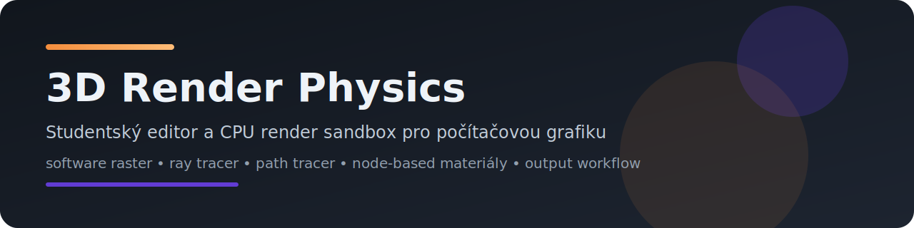

Čistě Java desktop editor a render sandbox zaměřený na počítačovou grafiku, CPU renderery, node-based materiály, editorové workflow a experimentální stylizované režimy. Program je navržený jako technický studentský projekt z grafiky: nesnaží se imitovat produkční DCC nebo produkční render engine, ale propojuje větší množství grafických subsystémů do jednoho konzistentního celku.

## Autor

**Jiří Pelikán**

## Obsah

- [Rychlý přehled](#rychlý-přehled)
- [Tvrdá data a ověřené statistiky](#tvrdá-data-a-ověřené-statistiky)
- [Co program aktuálně umí](#co-program-aktuálně-umí)
- [Architektura programu](#architektura-programu)
- [Renderery a stylizované režimy](#renderery-a-stylizované-režimy)
- [Matematické jádro](#matematické-jádro)
- [Materiálový systém](#materiálový-systém)
- [Temporal Noise](#temporal-noise)
- [Simulace a experimentální subsystémy](#simulace-a-experimentální-subsystémy)
- [Výstup a export](#výstup-a-export)
- [UI a workflow editoru](#ui-a-workflow-editoru)
- [Ovládání a zkratky](#ovládání-a-zkratky)
- [Import, primitiva a asset workflow](#import-primitiva-a-asset-workflow)
- [Build, spuštění a testy](#build-spuštění-a-testy)
- [Struktura repozitáře](#struktura-repozitáře)
- [Omezení a skutečný stav projektu](#omezení-a-skutečný-stav-projektu)
- [Další technická dokumentace](#další-technická-dokumentace)

## Rychlý přehled

| Oblast | Stav | Poznámka |
| --- | --- | --- |
| Editorové UI | stabilní | Swing/AWT, Blender-like layout |
| Raster viewport | stabilní | rychlé preview a stylizované módy |
| Viewport safety guard | stabilní | krátký recovery režim při přetížení, render failure nebo paměťovém tlaku |
| Ray tracer | stabilní | CPU offline renderer s BVH, stíny, odrazy a přenosem |
| Path tracer | stabilní | referenční CPU renderer pro lookdev a finální výstup |
| Materiálový graph | pokročilý | `MaterialNodeGraph` je authoring source of truth |
| Output workflow | stabilní | still / sequence / GIF / AVI (MJPEG), session folders |
| Spray / splash částice | experimentální | částicový overlay, ne fluid solver |
| Galaxy systém | experimentální scaffold | bez orbitálního nebo N-body solveru |

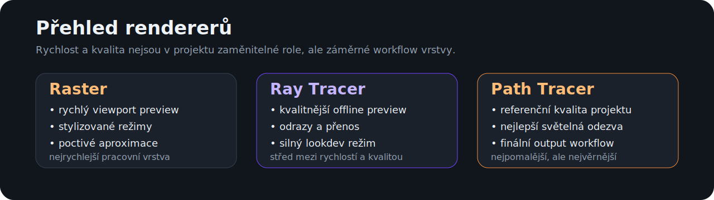

## Tvrdá data a ověřené statistiky

Tato sekce shrnuje čísla ověřená přímo nad aktuální codebase a referenční headless benchmarky vygenerované runnerem `tests/run-project-metrics.ps1` nebo `tests/run-project-metrics.sh`. Renderer benchmark tabulky níže používají `full` režim.

### Statistika codebase

| Metrika | Hodnota |
| --- | ---: |
| Java soubory v `src` | 204 |
| Neblank Java řádky v `src` | 46 382 |
| Java soubory v `tests` | 43 |
| Neblank Java řádky v `tests` | 7 403 |
| Automatické test suite entry pointy | 32 |
| Render módy | 9 |
| Node typy materiálového graphu | 24 |
| Materiálové presety | 9 |
| Preview primitiva | 3 |
| Preview lighting presety | 5 |
| Preview background režimy | 3 |
| Preview render režimy | 3 |
| Typy exportu | 4 |
| Základní primitiva | 9 |
| Featured primitiva | 2 |

### Import / export data

| Oblast | Aktuální stav |
| --- | --- |
| Import filtr v UI | `OBJ`, `STL`, `glTF`, `GLB`, `FBX` |
| Nativně obsloužené import cesty | `OBJ`, `STL`, `glTF`, `GLB` |
| FBX větev | filtr existuje, ale čistě Java importer ji má jako unsupported |
| Výstupní typy | `STILL`, `IMAGE_SEQUENCE`, `ANIMATED_GIF`, `ANIMATED_AVI` |
| Session artefakty | `manifest.json`, `preview.png`, `log.txt` |

### Rozdělení automatických testů

| Kategorie | Počet suite entry pointů |
| --- | ---: |
| Rendering | 12 |
| Materiály | 3 |
| Import / IO | 5 |
| Editor / core | 7 |
| Kvalita / prezentace | 2 |
| Ostatní | 3 |

### Benchmark metodika a transparentní parametry

| Parametr | Hodnota |
| --- | --- |
| Java runtime | `17.0.9` / `Java HotSpot(TM) 64-Bit Server VM` |
| OS | Windows 11 / `amd64` |
| Logické procesory | `24` |
| Renderer benchmark mode | `full` |
| Izolace případů | samostatný child JVM proces pro každý case |
| Core profily | `Single core = 1 worker`, `Half CPU = 12 worker` |
| Viewport rozlišení | `320x180`, `640x360`, `1920x1080` |
| Offline rozlišení | `160x90`, `320x180`, `640x360`, `1920x1080` |
| Viewport tuning | first-frame `4` samples, steady-frame `2` warm-up + `5` běhů × `3` passy |
| Offline tuning | first-frame `3` samples, steady-frame `1` warm-up + `3` běhy × `2` passy |
| Workload fáze | first-frame = `init + první render` na čerstvé instanci po case primingu, steady-frame = render po warm-upu |
| Statistika | `min`, `median`, `mean`, `p90`, `max`, `stddev` z raw sample; žádný `median-of-medians` |
| Kamera | perspective, `FOV 60°`, aspect podle rozlišení, pozice `(0.0, 1.3, 7.4 +/- bias)` |
| Poznámka | viewport a offline renderery mají oddělené resolution matice; interní optimalizace rendererů zůstávají zapnuté |
| Export benchmark zdroj | `8` předpřipravených PHONG frameů na daném rozlišení |
| Export benchmark formáty | `PNG still`, `JPG still`, `PNG sequence`, `GIF`, `AVI MJPEG` |
| JPG kvalita | `0.92` |
| GIF | `8` snímků, `24 FPS`, loop forever |
| AVI | `8` snímků, `24 FPS`, MJPEG quality `0.90` |

### Benchmark scénáře

| Scéna | Mesh entity | Světla | Trojúhelníky |
| --- | ---: | ---: | ---: |
| Lehká scéna / málo světel | 5 | 2 | 2 132 |
| Lehká scéna / více světel | 5 | 7 | 2 132 |
| Těžká scéna / málo světel | 9 | 2 | 21 228 |
| Těžká scéna / více světel | 9 | 10 | 21 228 |

### Referenční headless benchmark rendererů v `full` režimu

| Renderer | Family | Core profil | Počet case | First-frame geo median [ms] | Steady-frame geo median [ms] | Worst steady median [ms] |
| --- | --- | --- | ---: | ---: | ---: | ---: |
| Raster / PHONG | Viewport | Half CPU | 12 | 6.87 | 4.15 | 9.35 |
| Temporal Noise | Viewport | Half CPU | 12 | 46.20 | 6.58 | 24.10 |
| Hex Mosaic | Viewport | Half CPU | 12 | 39.40 | 7.60 | 36.28 |
| Dithering | Viewport | Half CPU | 12 | 26.08 | 17.17 | 91.78 |
| Path Tracing | Offline | Half CPU | 16 | 64.54 | 23.30 | 640.81 |
| Ray Tracing | Offline | Half CPU | 16 | 64.00 | 24.87 | 673.18 |
| Raster / PHONG | Viewport | Single core | 12 | 11.53 | 8.35 | 56.83 |
| Temporal Noise | Viewport | Single core | 12 | 46.37 | 8.86 | 37.51 |
| Hex Mosaic | Viewport | Single core | 12 | 40.11 | 13.37 | 90.10 |
| Dithering | Viewport | Single core | 12 | 34.18 | 24.15 | 154.21 |
| Path Tracing | Offline | Single core | 16 | 281.97 | 210.68 | 7571.76 |
| Ray Tracing | Offline | Single core | 16 | 284.94 | 233.30 | 6687.95 |

### Stress case na maximálním rozlišení (`heavy-many`, `Half CPU`)

| Renderer | Family | First median [ms] | Steady median [ms] | Steady p90 [ms] |
| --- | --- | ---: | ---: | ---: |
| Raster / PHONG | Viewport | 13.46 | 9.35 | 10.05 |
| Temporal Noise | Viewport | 232.80 | 23.55 | 25.11 |
| Hex Mosaic | Viewport | 167.71 | 31.32 | 35.86 |
| Dithering | Viewport | 122.42 | 91.78 | 102.79 |
| Path Tracing | Offline | 744.82 | 640.81 | 645.76 |
| Ray Tracing | Offline | 790.46 | 673.18 | 707.80 |

### Graf 1: Viewport steady-frame škálování podle rozlišení

`full` mode, `Half CPU`, průměr steady median přes všechny 4 benchmark scénáře.

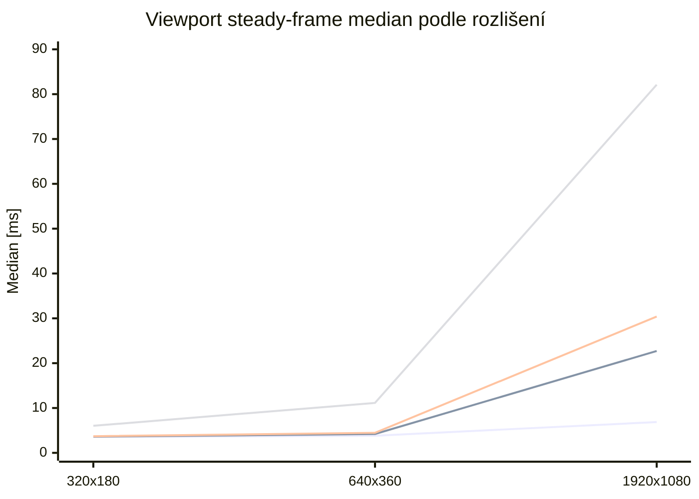

Graf ukazuje reálné steady-state chování viewport family. `Raster / PHONG` zůstává baseline, `Temporal Noise` a `Hex Mosaic` škálují hůř až ve vyšším rozlišení a `Dithering` je nejcitlivější na růst počtu pixelů.

### Graf 2: Offline steady-frame škálování podle rozlišení

`full` mode, `Half CPU`, průměr steady median přes všechny 4 benchmark scénáře.

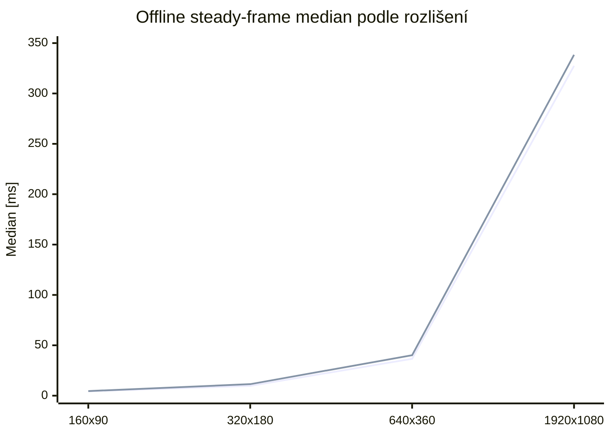

Tady je vidět skoro čisté násobení s počtem pixelů. `Path Tracing` zůstává v tomhle nastavení mírně levnější než `Ray Tracing`, ale oba offline renderery mají podobný řád náročnosti.

### Graf 3: First-frame vs. steady-frame v nejtěžším stress case

`heavy-many`, nejvyšší rozlišení dané renderer family, `Half CPU`.

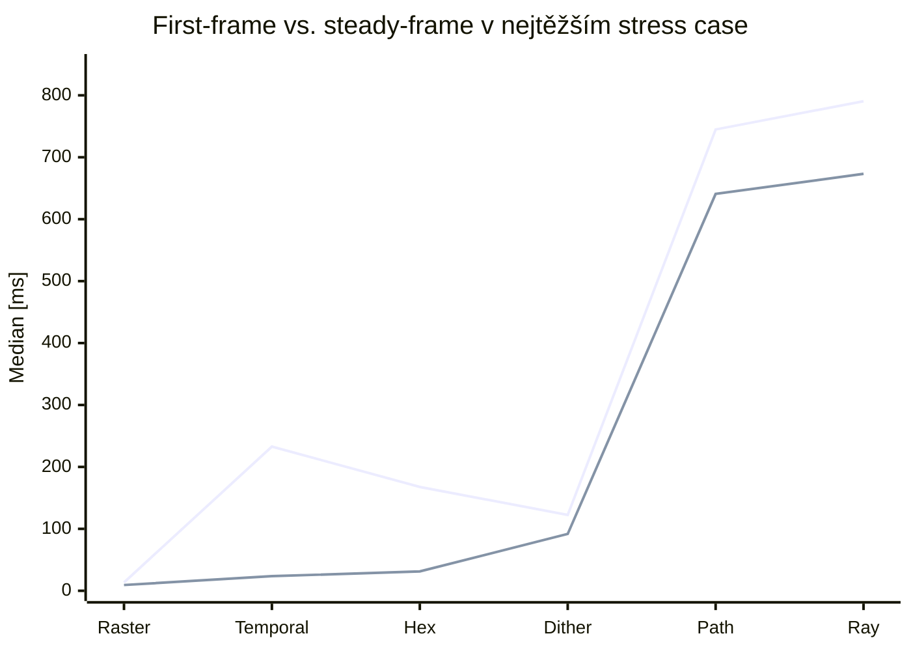

Tenhle graf je důležitý hlavně pro interpretaci `Temporal Noise` a `Hex Mosaic`: první snímek je výrazně dražší než ustálený běh, protože se budují pomocné mapy a analýza. Naopak u offline rendererů je rozdíl mezi first a steady mnohem menší, protože dominantní cena je samotný tracing.

### Jak ta čísla číst

- `Raster / PHONG` je referenční rychlý viewport baseline. Jedna klasická raster pipeline bez dodatečné full-screen syntézy se v datech chová přesně tak, jak odpovídá jeho složitosti.
- `Temporal Noise` má drahý first-frame, ale v `steady-frame` padá výrazně níž, protože benchmark drží scénu i kameru statickou a renderer typicky reuseuje analyzační cache. Pro dynamické sekvence je potřeba sledovat i first-frame a stress rows, ne jen steady median.
- `Hex Mosaic` a `Dithering` jsou záměrně měřené se zapnutými interními passy. Benchmark tedy neporovnává „stejný shader ve stejné pipeline“, ale reálné defaultní workloady těch rendererů.
- `Ray Tracing` a `Path Tracing` jsou uváděné odděleně od viewport family. Jejich absolutní časy jsou ovlivněné BVH, shadow rays, přímým světlem a 1 SPP nastavením; porovnání má smysl hlavně uvnitř offline family.

### Hrubá matematická a výpočetní složitost

Použité symboly:
- `V` = počet vrcholů
- `T` = počet trojúhelníků
- `P` = počet pixelů (`width * height`)
- `L` = počet aktivních světel
- `C` = počet buněk / cell struktur v postprocesu
- `D` = maximální ray depth / počet bounce

| Renderer | Přibližný dominantní tvar | Co to znamená v praxi |
| --- | --- | --- |
| Raster / PHONG | `O(V + T * tileOverlap + P * L)` | klasická raster pipeline, nejnižší konstanty, dobrý viewport baseline |
| Dithering | `O(2 * Raster + P)` | lit base pass + unlit detail reference + full-screen syntéza; proto je nejdražší viewport steady renderer |
| Temporal Noise | first-frame přibližně `O(Raster_unlit + P + neighborhood analysis)`, steady ve statické scéně blíž k `O(Raster_unlit + P)` | vysoký first-frame, levnější steady díky reuse analýzy |
| Hex Mosaic | `O(Raster + P + C)` | base raster + per-pixel akumulace do buněk + compose; roste víc s pixely než čistý raster |
| Ray Tracing | first-frame přibližně `O(T log T + P * D * (BVH + L * shadowBVH))`, steady bez rebuildů hlavně `O(P * D * (BVH + L * shadowBVH))` | světla a shadow rays bolí víc než samotný růst geometrie |
| Path Tracing | `O(T log T + P * E[D] * (BVH + L * shadowBVH))` | stejný řád jako ray tracer, ale často o něco levnější díky sampling branchím a Russian roulette |

Tyhle tvary nejsou formální důkaz přesné complexity každého řádku kódu; jsou to zjednodušené dominantní modely, které odpovídají tomu, co renderery v téhle codebase skutečně dělají a co benchmark naměřil.

### Export benchmark podle formátu a rozlišení

Tato tabulka měří čistě zápis formátu nad připravenými snímky. Nejde tedy o plný čas `render + export`, ale o samotnou náročnost export pipeline pro jednotlivé formáty.

| Formát | 640x360 median [ms] | 640x360 velikost | 1280x720 median [ms] | 1280x720 velikost | 1920x1080 median [ms] | 1920x1080 velikost |
| --- | ---: | ---: | ---: | ---: | ---: | ---: |
| PNG still | 10.10 | 0.02 MB | 21.26 | 0.08 MB | 51.54 | 0.20 MB |
| JPG still | 9.94 | 0.01 MB | 22.54 | 0.02 MB | 39.23 | 0.04 MB |
| PNG sequence | 46.35 | 0.12 MB | 173.96 | 0.62 MB | 443.68 | 1.64 MB |
| GIF | 160.53 | 0.31 MB | 675.74 | 0.91 MB | 1452.57 | 1.87 MB |
| AVI MJPEG | 34.03 | 0.06 MB | 110.27 | 0.18 MB | 249.47 | 0.35 MB |

> Benchmark tabulka je určená jako reprodukovatelný referenční údaj pro tento repozitář, ne jako absolutní srovnání s jinými enginy. Smysl tabulek je ukázat relativní náklad rendererů v rámci stejné codebase, stejného runneru a transparentně popsaných workloadů.

## Co program aktuálně umí

- Blender-like rozložení editoru: toolbar nahoře, viewport uprostřed, properties vpravo, spodní workspace dock.
- Software raster renderer pro rychlý viewport.
- CPU `RayTracerRenderer` a `PathTracerRenderer`.
- Stylizované režimy `Wireframe`, `Dithering`, `Temporal Noise` a `Hex Mosaic`.
- Dither pipeline se sdíleným adaptivním kontrastem a `ASCII` variantou, která vybírá glyph podle podobnosti skutečného obrazového bloku.
- Materiálový workspace s node graph editorem, preview panelem a inspektorem uzlů.
- Sdílené materiálové vyhodnocení napříč raster/ray/path renderery.
- Import modelů `OBJ`, `STL`, `glTF`, `GLB`, `FBX`.
- Output workflow pro statický snímek, sekvenci, GIF a AVI (MJPEG) bez externích nástrojů.
- Session-based export s `manifest.json`, `preview.png`, `log.txt` a oddělenými session složkami.
- Časovou osu, klíčování a základní editorovou historii.
- Lehký viewport safety guard, který při přetížení krátce podrží frame a dočasně stáhne interní náročnost.
- Experimentální spray/splash emitter a scaffold pro galaxy systém.

## Architektura programu

Program používá modulární rozdělení podle odpovědností:

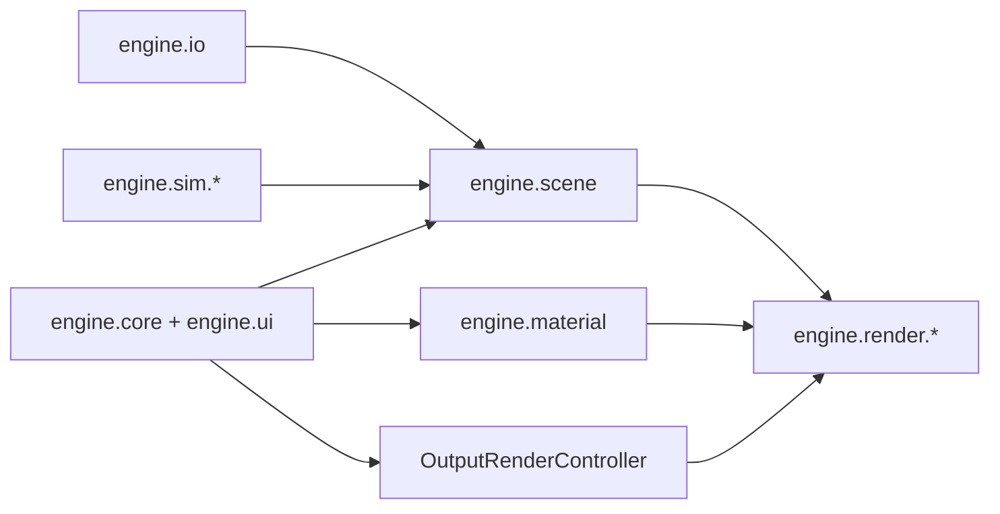

### Praktické členění

- `engine.core`
  - lifecycle aplikace,
  - toolbar, properties, docky,
  - history, shortcut routing, output workflow.
- `engine.render`
  - raster renderer,
  - ray tracer,
  - path tracer,
  - stylizované post/styl renderery.
- `engine.material`
  - `PhongMaterial` jako kompatibilní obálka,
  - `MaterialNodeGraph` jako authoring source of truth,
  - evaluace graphu, preview, texture-set import.
- `engine.scene`
  - entity, světla, transformace, scéna.
- `engine.sim`
  - experimentální simulace a overlay subsystémy.
- `engine.io`
  - import modelů a parsování souborových formátů.

## Renderery a stylizované režimy

### Přehled render režimů

| Režim | Implementace | Účel | Rychlost | Poznámka |
| --- | --- | --- | --- | --- |
| `MODEL` | lehký raster preview | blokování tvaru a navigace | velmi vysoká | bez plného materiálového výsledku |
| `BASIC` | jednoduchý raster | rychlý layout | vysoká | základní barevný náhled |
| `PHONG` | hlavní viewport raster | běžná práce ve viewportu | vysoká | hlavní realtime preview |
| `WIREFRAME` | stylizovaný edge renderer | kontrola topologie a siluet | vysoká | volitelné skryté hrany / silueta |
| `DITHERING` | post styl | stylizovaný obraz | střední | styly `BLUE_NOISE`, `PATTERN`, `ASCII`; `ASCII` vybírá glyph podle podobnosti obrazového bloku |
| `TEMPORAL_NOISE` | post styl nad G-bufferem | motion-defined forma z pohybu šumu | střední | integer 2D grain, regionální posuv |
| `HEX_MOSAIC` | post styl | stylizovaná hex mozaika | střední | buňka, outline, theme |
| `RAY_TRACING` | CPU ray tracer | kvalitnější offline preview | nižší | stíny, odrazy, přenos |
| `PATH_TRACING` | CPU path tracer | referenční lookdev / finální výstup | nejnižší | nejvěrnější interpretace materiálů |

### Raster vs. Ray vs. Path

| Oblast | Raster | Ray | Path |
| --- | --- | --- | --- |
| Surface shading | preview aproximace | silná interpretace | referenční interpretace |
| Glass / transmission | omezená aproximace | použitelná | nejlepší varianta v projektu |
| Transparent BSDF | aproximace | použitelný | použitelný |
| Volume medium | homogenní preview aproximace | omezené homogenní médium | nejlepší homogenní médium v projektu |
| Normal map | ano | ano | ano |
| Mix Shader | aproximovaný sample | smysluplné closure mixing | smysluplné closure mixing |

### Hlavní render nastavení v UI

| Oblast | Nastavení |
| --- | --- |
| Globální viewport | frustum culling, backface culling, paralelní raster, post AA, progresivní viewport, culling podle vzdálenosti, fallback režim, cílové FPS, render scale, počet vláken |
| Wireframe | hloubkově skryté hrany, zvýraznění siluety, přerušované hrany |
| Dither | styl, počet tónů, kontrast, světelná pomoc, invert; v `ASCII` navíc velikost buňky a ASCII znaková sada |
| Temporal Noise | tempo posuvu, blízkostní příspěvek, příspěvek šikmého úhlu, minimální rychlost, maximální rychlost, síla okrajového blendu, velikost zrna, úrovně palety |
| Hex Mosaic | velikost buňky, kvantizace, outline, wow strength, theme, edge aware, škálování vzdáleností, debug buněk |
| Ray Tracing | vzorky / snímek, tile size, diffuse/glossy/transmission/volume/transparent depth, přímé světlo, stíny, odrazy, denoise |
| Path Tracing | vzorky / snímek, tile size, diffuse/glossy/transmission/volume/transparent depth, přímé světlo, obloha, denoise |

### Dither / ASCII

`DitherRenderer` už nepracuje jen jako jednoduché prahování nad průměrným jasem.

- `BLUE_NOISE` a `PATTERN` sdílejí připravenou luminanci s adaptivním kontrastem, světelnou pomocí a obnovou detailu.
- `ASCII` pro každou buňku normalizuje malý blok obrazu, porovná ho s bitmapami kandidátních glyphů a vybere znak s nejmenší chybou.
- `Počet tónů`, `Kontrast`, `Světelná pomoc` a `Invertovat` fungují napříč všemi dither styly.
- `Velikost buňky` a `Znaková sada ASCII` se v UI ukazují jen pro `ASCII`, aby v panelu nezůstávaly mrtvé volby.
- Při `ASCII` se ve viewportu záměrně vypíná adaptivní interní scale, aby mřížka buněk neproblikávala při pohybu.

### Render pipeline

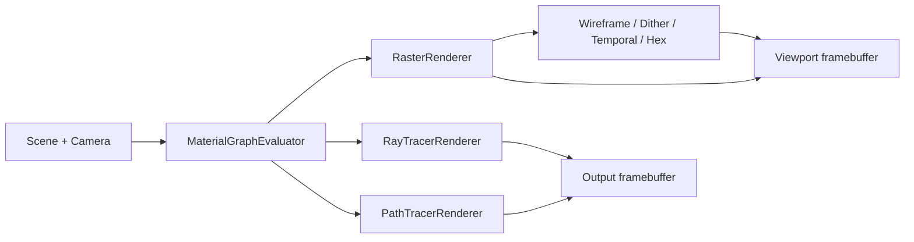

## Matematické jádro

Tato sekce shrnuje hlavní matematické vztahy, které program skutečně používá nebo které přímo odpovídají aktuální implementaci.

### 1. Transformace vrcholů

Raster větev převádí vrcholy přes modelovou, view a projekční transformaci do clip prostoru a potom do `NDC` a screen-space:

$$
\mathbf{p}_{world} = M \cdot \begin{bmatrix}x \\ y \\ z \\ 1\end{bmatrix}
$$

$$
\mathbf{p}_{clip} = VP \cdot \mathbf{p}_{world}
$$

$$
\mathbf{p}_{ndc} = \frac{\mathbf{p}_{clip.xyz}}{w_{clip}}
$$

$$
x_{screen} = \left(\frac{x_{ndc}}{2} + \frac{1}{2}\right)(W-1), \qquad
y_{screen} = \left(1 - \left(\frac{y_{ndc}}{2} + \frac{1}{2}\right)\right)(H-1)
$$

World-space normály se transformují přes `normalMatrix`, tj. horní levou `3x3` část inverse-transpose modelové matice.

### 2. Ray tracer a path tracer

Oba offline renderery používají akceleraci přes BVH a drží průchod paprsku ve standardním tvaru:

$$
\mathbf{r}(t) = \mathbf{o} + t\mathbf{d}
$$

Oba renderery drží barevný throughput:

$$
\mathbf{T}_{k+1} = \mathbf{T}_{k} \odot \mathbf{w}_{branch}
$$

Celková radiance se skládá z emisí, přímého světla a navazujících větví:

$$
\mathbf{L} = \sum_k \mathbf{T}_k \odot \left(\mathbf{L}_{direct,k} + \mathbf{L}_{emission,k}\right)
$$

#### Ray tracer

`RayTracerRenderer` je determinističtější offline renderer. V každém zásahu:

- vyhodnotí přímé osvětlení přes směrová a bodová světla,
- z materiálu odvodí odraz, přenos a lokální váhu povrchového příspěvku,
- pokračuje jednou dominantní větví, ne plným stochastickým stromem.

Lokální specular term používá half-vector:

$$
\mathbf{h} = \frac{\mathbf{l} + \mathbf{v}}{\|\mathbf{l} + \mathbf{v}\|}
$$

$$
spec = \max(0,\mathbf{n}\cdot\mathbf{h})^{p}
$$

Reflexní větev používá klasický odraz:

$$
\mathbf{r} = \mathbf{d} - 2(\mathbf{d}\cdot\mathbf{n})\mathbf{n}
$$

Přenos používá Snellův lom přes pomocnou vektorovou operaci `refract(...)`, a síla větví se řídí Schlickovým Fresnelem:

```math
F(\cos\theta) = F_0 + (1-F_0)(1-\cos\theta)^5,\qquad
F_0 = \left(\frac{1-\eta}{1+\eta}\right)^2
```

Implementačně je důležité, že ray tracer:

- drží omezenou hloubku `maxDepth`,
- nepoužívá Monte Carlo větvení přes PDF,
- nepoužívá Russian roulette,
- a slouží jako rychlejší offline preview s odrazy, stíny a přenosem.

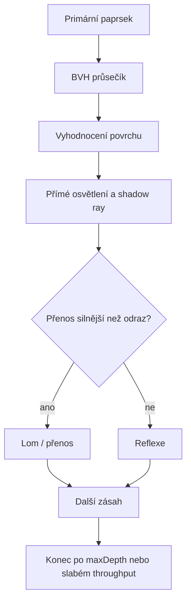

#### Path tracer

`PathTracerRenderer` je v programu skutečně **Monte Carlo path tracer**. Používá náhodné samplování paprsků, branch probability a throughput kompenzaci přes inverzi branch PDF.

V každém bounce se nejdřív odvodí tři pravděpodobnosti:

$$
p_t = transmissionProbability,\qquad
p_s = specProbability,\qquad
p_d = 1 - p_t - p_s
$$

Pak se náhodně volí jedna větev. Throughput se škáluje praktickým Monte Carlo estimátorem:

```math
\mathbf{T}_{k+1} =
\mathbf{T}_{k} \odot \frac{\mathbf{w}_{branch}}{p_{branch}}
```

Difuzní větev používá cosine-weighted hemisphere sampling:

$$
\mathbf{\omega}_{sample} \sim p(\omega) = \frac{\max(0,\mathbf{n}\cdot\omega)}{\pi}
$$

Specular větev vychází z perfektní reflexe a pro nenulovou roughness ji míchá s cosine sample:

$$
\mathbf{\omega}_{spec} = lerp(\mathbf{r},\mathbf{\omega}_{hemi}, roughness)
$$

To je zjednodušený, ale prakticky stabilní model, který odpovídá aktuální implementaci v kódu.

Path tracer navíc dělá explicitní next-event lighting pro všechna směrová a bodová světla. To znamená, že kromě nepřímé stochastické větve v každém zásahu ještě:

- vzorkuje světla přímo,
- vystřelí shadow ray,
- a přičte viditelný přímý příspěvek.

Od třetího bounce dál používá **Russian roulette**:

```math
rr = clamp(\max(T_r,T_g,T_b),\ 0.05,\ 0.98)
```

Paprska buď ukončí s pravděpodobností `1 - rr`, nebo throughput doškáluje:

```math
\mathbf{T} \leftarrow \frac{\mathbf{T}}{rr}
```

To snižuje délku dlouhých drah bez systematického biasu. Přesněji řečeno:

- **Monte Carlo** je hlavní integrační metoda,
- **Russian roulette** je technika ukončování drah uvnitř Monte Carlo integrace.

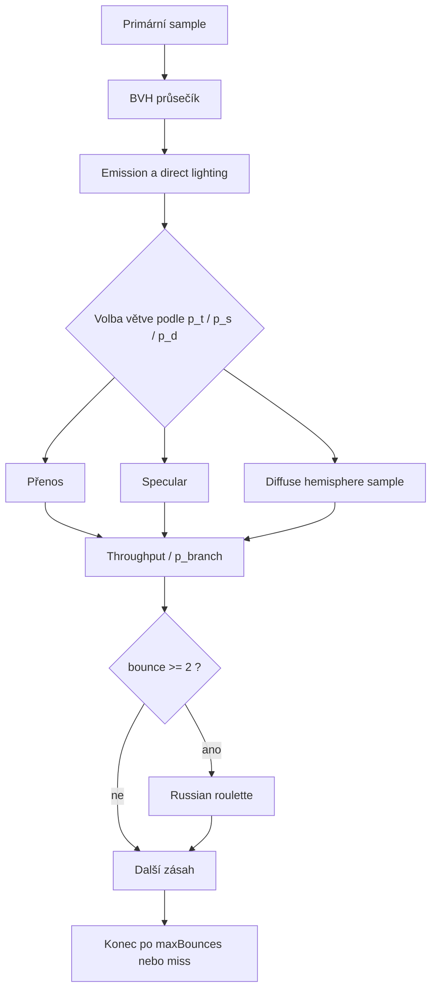

#### Praktický rozdíl mezi renderery

| Oblast | Ray tracer | Path tracer |
| --- | --- | --- |
| Typ integrace | determinističtější větvení | Monte Carlo sampling |
| Odraz / lom | dominantní větev | stochastická volba větve |
| Přímé světlo | explicitně | explicitně + nepřímé sample |
| Throughput/PDF | bez branch PDF kompenzace | branch PDF kompenzace `1 / p_branch` |
| Russian roulette | ne | ano, od `bounce >= 2` |
| Typ použití | rychlejší offline preview | referenční kvalitnější výstup |

### 3. Materiálový preview renderer

Lookdev preview v materiálovém workspace není mini path tracer; používá rychlý analytický preview model s ambient složkou, difuzním osvětlením, specular highlightem a Schlick-like fresnelem:

$$
specTerm = \max(0, \mathbf{n}\cdot\mathbf{h})^{specPow}
$$

$$
fresnel = (1 - \mathbf{n}\cdot\mathbf{v})^5
$$

Pro volume preview používá homogenní směs hustoty a tloušťky:

$$
fog = clamp(density \cdot 0.26 + thickness \cdot 0.08)
$$

### 4. Spray / splash simulace

Experimentální water vrstva je ve skutečnosti deterministický CPU částicový spray. Nepoužívá tlakový solve, PBF ani SPH.

Pro každou částici platí:

$$
\mathbf{v} = \mathbf{v} + \mathbf{g}\cdot gravityScale \cdot dt
$$

$$
\mathbf{v} = \mathbf{v}\cdot e^{-drag \cdot dt}
$$

$$
\mathbf{p} = \mathbf{p} + \mathbf{v}\cdot dt
$$

Podlaha a AABB proxy kolize používají jednoduchý bounce model:

$$
v_{normal} = -v_{normal}\cdot bounce
$$

Tangenciální složky se tlumí přes `surfaceDamping`.

## Materiálový systém

### Source of truth

Materiály jsou graph-driven:

- `MaterialNodeGraph` je authoring source of truth,
- uzly drží své defaulty per-instance,
- inspektor upravuje konkrétní instanci uzlu,
- `PhongMaterial` zůstává jako kompatibilní kontejner pro import a render bridge.

### Hlavní uzly

| Kategorie | Uzly |
| --- | --- |
| Surface | `Principled BSDF`, `Glass BSDF`, `Transparent BSDF`, `Emission`, `Mix Shader` |
| Volume | `Volume Medium` |
| Texture / coord | `Texture Coordinate`, `Mapping`, `Image Texture`, `Normal Map` |
| Utility | `Separate RGB`, `Combine RGB`, `RGB`, `Value`, `Noise Texture`, `Color Ramp`, `Mix Color`, `Math`, `Clamp`, `Map Range` |
| Output | `Output Material` |

### Podpora napříč renderery

| Uzel / oblast | Raster | Ray | Path |
| --- | --- | --- | --- |
| `Principled BSDF` | plně použitelný preview | plně použitelný | plně použitelný |
| `Glass BSDF` | aproximace | plně použitelný | plně použitelný |
| `Transparent BSDF` | aproximace | plně použitelný | plně použitelný |
| `Mix Shader` | aproximovaný výsledný sample | plně použitelný | plně použitelný |
| `Volume Medium` | preview aproximace | částečně | nejvěrnější varianta v programu |
| `Normal Map` | ano | ano | ano |

### Preview a lookdev

Materiálový workspace obsahuje:

- lookdev preview,
- node canvas,
- node inspector,
- shrnutí podpory rendererů.

Preview podporuje:

| Oblast | Volby |
| --- | --- |
| Primitivum | `Sphere`, `Rounded Cube`, `Plane` |
| Světelný preset | `Studio Soft`, `Hard Rim`, `Warm Sunset`, `Neutral White`, `Dark Contrast` |
| Pozadí | `Dark`, `Gray`, `Checker` |
| Režim preview | `Fast Preview (Raster)`, `Ray Preview`, `Path Preview` |

### PBR texture-set import

Importer rozpoznává role podle názvů souborů:

- `basecolor` / `albedo` / `diffuse`
- `roughness`
- `metallic` / `metalness`
- `metallicroughness`
- `normal`
- `emissive`
- `opacity` / `alpha`
- `ao`

Automaticky staví graph:

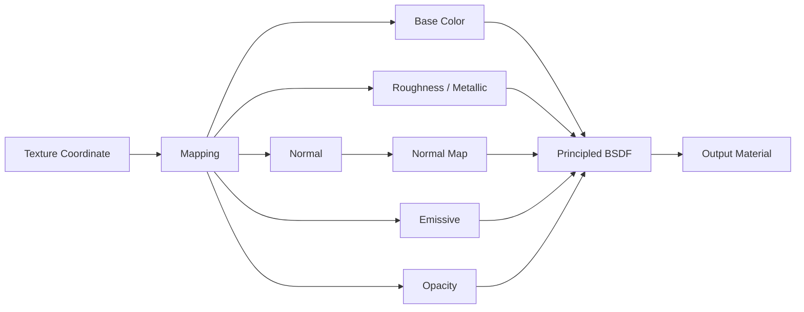

## Temporal Noise

`Temporal Noise` je stylizovaný režim pro motion-defined form. Aktuální implementace je úmyslně úzká a praktická:

- jde o čistý 2D post-process nad hotovým G-bufferem,
- background zůstává statický,
- objekty posouvají stabilní grain po integer mřížce,
- grain se nikdy nedeformuje subpixelovou interpolací,
- zrno lze přepnout mezi `1x1`, `2x2`, `4x4`.

### Přesná pipeline

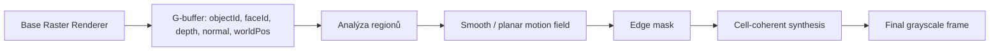

Renderer postupuje takto:

1. `baseRasterRenderer.render(...)` připraví G-buffer.
2. Z `objectId`, `faceId`, `depth`, `normal` a `worldPos` se odvodí regionální motion parametry.
3. Motion field se stabilizuje pro smooth a coplanární plochy.
4. `edgeMask` označí konfliktní přechody.
5. Finální syntéza vykreslí každou grain buňku jednou společnou hodnotou.

To je důležité proto, že velikost zrna neurčuje jen vzhled, ale i skutečnou vykreslovací mřížku. Hrubší preset `4x4` proto negeneruje jemnější subpixely uvnitř buňky.

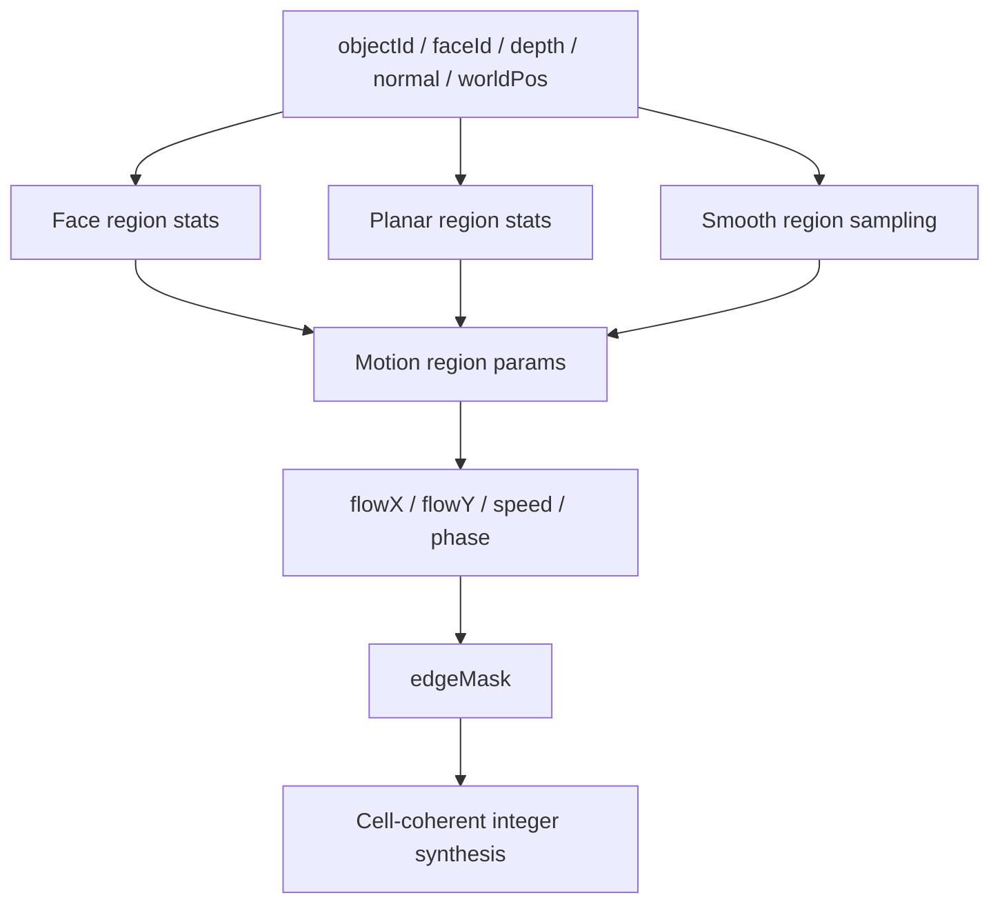

### Regionální směr

Směr regionu vychází z průměrné regionální normály promítnuté do screen-space:

$$
normalScreenX = \mathbf{n}\cdot\mathbf{r}
$$

$$
normalScreenY = -(\mathbf{n}\cdot\mathbf{u})
$$

$$
\mathbf{d}_{2D} = (-normalScreenY,\; normalScreenX)
$$

K tomu se přičítá malý screen-space bias z perspektivní polohy regionu:

```math
desired_x = d_{2D,x} + screenBias_x \cdot signBias
```

```math
desired_y = d_{2D,y} + screenBias_y \cdot signBias
```

Výsledek se pak neotáčí libovolně, ale převádí se do stabilních osových vah `X/Y`. Tím:

- zůstává zrno pevné na mřížce,
- region může běžet po `X`, po `Y` nebo po obou osách současně,
- ale nevzniká subpixelová deformace patternu.

### Regionální rychlost

Aktuální implementace skládá rychlost z blízkosti, šikmého úhlu, kontrastu orientace a malého deterministického regionálního biasu:

```math
grazing = 1 - facing
```

```math
speed =
clamp\left(
0.45 + 1.20 \left(
0.90\,nearContribution\,depthNear +
1.02\,grazingContribution\,grazing +
0.46\,orientationContrast +
c\,perspectiveContrast
\right)
+ regionBias,\;
minSpeed,\;
maxSpeed
\right)
```

`regionBias` je deterministický hash z `objectId`, kvantizované normály, hloubky a screen-space polohy. Tím se snižuje pravděpodobnost, že dvě různé plochy skončí se stejnou osou i stejnou rychlostí.

V implementaci se rychlost ještě kvantizuje do diskrétních pásem. To zmenšuje shimmering mezi sousedními regiony a zlepšuje čitelnost pohybu na složitějších modelech.

### Integer shift a grain

Pro region se počítá diskrétní posuv:

$$
shift(t) = \left\lfloor t \cdot temporalTickRate \cdot speed + phase \right\rfloor
$$

Z něj vznikne společný posuv po `X` a `Y`:

$$
\Delta x = sign_x \cdot round\left(shift \cdot \frac{|w_x|}{\max(|w_x|, |w_y|)}\right)
$$

$$
\Delta y = sign_y \cdot round\left(shift \cdot \frac{|w_y|}{\max(|w_x|, |w_y|)}\right)
$$

Noise se pak čte **bez interpolace** a bez jakéhokoli warpu:

$$
a = random01(cell_x + \Delta x,\; cell_y + \Delta y,\; 0,\; seed_A)
$$

$$
b = random01(cell_x + \Delta x + 17,\; cell_y + \Delta y - 11,\; 0,\; seed_B)
$$

$$
signal = 0.72a + 0.28b
$$

Finální hodnota se kvantizuje do palety `2..8` úrovní a mapuje do rozsahu `28..228`. Finální cell-coherent syntéza navíc používá pro celou grain buňku jednoho reprezentanta, takže:

- `1x1` kreslí pixel po pixelu,
- `2x2` kreslí skutečné `2x2` bloky,
- `4x4` kreslí skutečné `4x4` bloky,
- a nevzniká situace, kdy by uvnitř hrubé buňky vznikly menší spoty.

### Smooth regiony

U smooth objektů se region nebere po samotném `faceId`, ale z lokálního sousedství. Soused je považovaný za kompatibilní pouze pokud:

$$
objectId_i = objectId_j
$$

$$
|depth_i - depth_j| \le 0.015
$$

$$
\mathbf{n}_i \cdot \mathbf{n}_j \ge 0.97
$$

To snižuje polygonální rozpad na koulích a zaoblených modelech, ale ostré hrany zůstávají oddělené. Nad tím ještě běží:

- `smoothCellMotionField(...)` pro vyhlazení mezi kompatibilními smooth buňkami,
- `enforcePlanarRegionConsistency(...)` pro sjednocení coplanárních ploch,
- `normalizeUniformCells(...)` pro zpevnění jednotných grain buněk.

Prakticky to znamená:

- krychle drží jednolitou stěnu,
- koule se méně rozpadají na trojúhelníkové ostrůvky,
- a překrývající se vrstvy se méně slévají.

### Hrany a překryvy

`edgeMask` se staví z rozdílu hloubky, normály a raw flow:

```math
edge = \max\left(
boundary,\;
0.78\,normalTerm + 0.62\,depthTerm + flowTerm
\right)
```

kde:

```math
depthTerm = clamp(|depth_i - depth_j| \cdot 28)
```

```math
flowTerm = clamp\left(\|\Delta flow\| \cdot 0.18\right)
```

Na hraně se neprovádí další blur. Místo toho se jen mírně míchá objektový a background signál:

```math
signal = lerp(objectSignal,\ backgroundSignal,\ blend)
```

```math
blend = clamp(\max(edgeMask \cdot edgeBlendStrength,\ 1-objectCoverage))
```

Tím se omezí tvrdé seam přechody, ale nesmyje se celé zobrazení do měkké mapy.

### Proč je režim relativně levný

`Temporal Noise` je rychlejší než ray/path tracing proto, že:

- reuseuje hotový raster G-buffer,
- neřeší sekundární geometrii ani světelné větvení,
- nepoužívá subpixelový sampling šumu,
- nevzorkuje 3D noise pole,
- a finální pass používá jen integer posuv, dva hash sample kanály a kvantizaci do grayscale palety.

### Aktuální ovladače

| Parametr | Význam |
| --- | --- |
| `Tempo posuvu` | globální rychlost časového kroku |
| `Blízkostní příspěvek` | zesílení rychlosti pro bližší regiony |
| `Příspěvek šikmého úhlu` | zesílení rychlosti pro grazing plochy |
| `Minimální rychlost` | dolní clamp rychlosti regionu |
| `Maximální rychlost` | horní clamp rychlosti regionu |
| `Síla okrajového blendu` | lehký blend objektového a background signálu na hranách |
| `Velikost zrna` | preset `1x1`, `2x2`, `4x4` |
| `Úrovně palety` | počet grayscale úrovní po kvantizaci |

### Debug view

Renderer umí debug pohledy:

- `FINAL`
- `NEUTRAL_BASE`
- `FLOW_FIELD`
- `EDGE_MASK`
- `PHASE_MAP`
- `DEPTH_LAYER`

Tyto pohledy pomáhají kontrolovat:

- osový směr pohybu,
- masku hran,
- regionální fázi,
- depth metriku,
- stabilitu grainu.

## Simulace a experimentální subsystémy

### Spray / splash systém

Program obsahuje scénově navázaný emitter částic:

- částice se spawnují z `WaterEmitterEntity`,
- integrace běží deterministicky na CPU,
- kolize používají podlahu a jednoduché AABB proxy scény,
- runtime i output replay používají shodnou fixed-step logiku.

Vymezení:

- nejde o fluid solver,
- nejde o PBF/SPH,
- nejde o surface reconstruction.

### Galaxy systém

`GalaxySimulation` je aktuálně experimentální scaffold:

- sleduje galaxy entity,
- synchronizuje je se scénou,
- ale neprovádí orbitální nebo N-body simulaci.

## Výstup a export

Output workflow je session-based a oddělené od realtime viewportu.

### Typy exportu

| Typ | Výstup |
| --- | --- |
| Still image | `still.png` nebo `still.jpg` |
| Image sequence | `sequence/frame_0000.png` nebo `.jpg` |
| Animated GIF | `animation.gif` |
| AVI | `animation.avi` jako MJPEG |

### Session složka

Každý job může vytvořit vlastní session složku:

```text
session/
  manifest.json
  preview.png
  log.txt
  still.png / still.jpg
  sequence/frame_0000.png
  animation.gif
  animation.avi
```

### Output pipeline

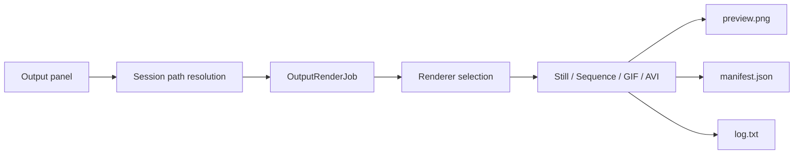

### Co output ukládá

`manifest.json` typicky obsahuje:

- export type,
- renderer,
- rozlišení,
- interní rozlišení,
- sampling / depth volby,
- frame range,
- fps,
- generated files,
- duration,
- cancelled / success stav.

AVI export používá čistě JDK implementaci MJPEG AVI writeru. Program nepoužívá `ffmpeg` ani externí proces.

### Hlavní nastavení output panelu

| Sekce | Nastavení |
| --- | --- |
| Cíl výstupu | základní složka, session folder, timestamp, prefix session |
| Typ výstupu | still, sequence, GIF, AVI |
| Rozsah a časování | use timeline range, start, end, FPS, počet snímků, délka |
| Formát | PNG / JPG, JPG quality, GIF loop, MJPEG quality |
| Renderer výstupu | volba rendereru, převzetí rendereru viewportu, synchronizace output kamery |
| Kvalita a výkon | width, height, internal scale, worker count, tile size, target samples, samples per step, max depth, denoise |
| Specifická nastavení | wireframe, dither, temporal noise, ray/path, hex podle zvoleného režimu |

## UI a workflow editoru

Program drží Blender-like logiku rozvržení, ale zůstává Swing/AWT desktop aplikací.

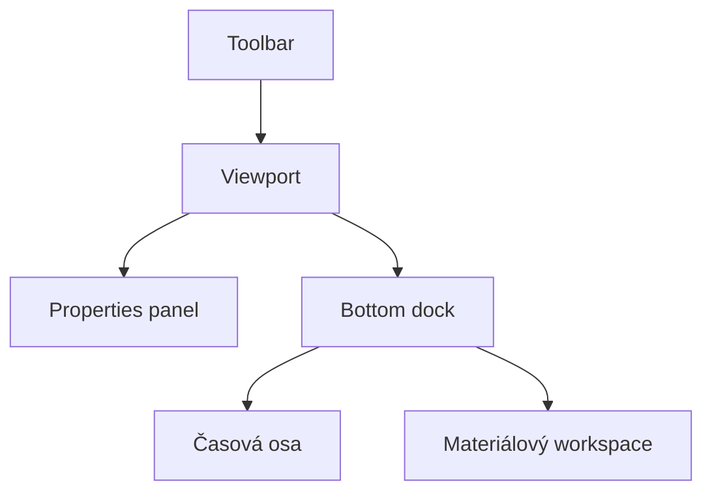

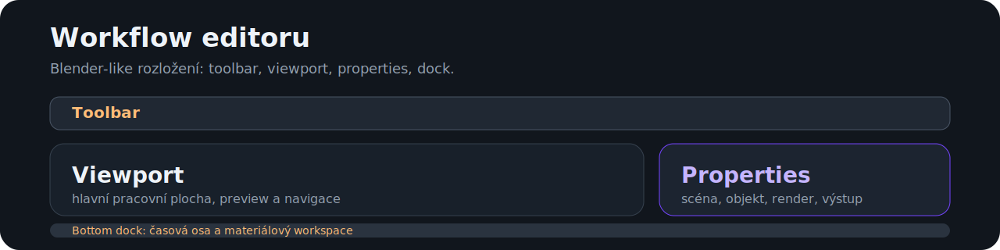

### Hlavní části UI

| Oblast | Funkce |
| --- | --- |
| Toolbar | rychlé render módy, navigace, runtime přepínače |
| Viewport | hlavní pracovní plocha |
| Properties panel | scéna, prostředí, zobrazení, objekt, render, výstup |
| Bottom dock | časová osa a materiálový workspace |
| Materiálový workspace | preview, graph, inspector, summary |

### Pravý panel

Pravý panel obsahuje karty:

- `Scene`
- `World`
- `View`
- `Object`
- `Render`
- `Output`

## Ovládání a zkratky

### Globální editorové zkratky

| Zkratka | Funkce |
| --- | --- |
| `Ctrl+Z` | undo |
| `Ctrl+Shift+Z` / `Ctrl+Y` | redo |
| `Delete` | smazání výběru |
| `Ctrl+D` | duplicate v editorech, kde dává smysl |
| `F` | frame selected |
| `Home` | frame all podle kontextu |
| `Escape` | zrušení transient operace / uvolnění capture |

### Viewport a render režimy

| Klávesa | Funkce |
| --- | --- |
| `G` | `MODEL` |
| `1` | `BASIC` |
| `2` | `PHONG` |
| `3` | `WIREFRAME` |
| `4` | `DITHERING` |
| `5` | `ASCII` styl v ditheringu |
| `6` | `TEMPORAL_NOISE` |
| `7` | `RAY_TRACING` |
| `8` / `0` | `PATH_TRACING` |
| `9` | `HEX_MOSAIC` |
| `Z` | cyklus render módů |
| `F1` nebo <code>`</code> | cyklus dithering stylů |
| `V` | cyklus variant `Temporal Noise` |
| `Ž` | v `Temporal Noise` cyklus grain presetů `1x1 -> 2x2 -> 4x4` |
| `U` | cyklus `Hex` wow stylu |
| `Y` | debug buněk v `Hex` |

### Kamera a navigace

| Zkratka | Funkce |
| --- | --- |
| `Q` | FPS preset navigace |
| `E` | Blender preset navigace |
| `Tab` | cyklus módů kamery |
| `F4` / `O` | perspektiva / ortho |
| `Ctrl+Numpad 1/3/7` | přední / pravý / horní pohled |
| `WASD`, šipky, `Space`, `Ctrl` | pohyb v FPS režimu |
| `MMB`, `Shift+MMB`, kolečko | orbit / pan / zoom v Blender preset režimu |

### Časová osa

| Zkratka | Funkce |
| --- | --- |
| `Space` v Blender preset režimu | play / pause animace |
| `Left`, `Right` | krok po snímcích |
| `Insert` | vložit klíč |
| `Shift+Insert` | smazat klíč |
| `Ctrl+Insert` | vložit klíč pro všechny animovatelné cíle |
| `K` | vložit klíč pro výběr |
| `Shift+K` | release klíč pro fyziku |

### Přidávání a transformace

| Zkratka | Funkce |
| --- | --- |
| `Shift+A` | add menu |
| `C` | cube |
| `S` | sphere |
| `P` | plane |
| `Y` | cylinder |
| `N` | cone |
| `T` | torus |
| `H` | capsule |
| `R` | pyramid |
| `D` | crystal |
| `K` | torus knot |
| `Alt+G` / `Alt+R` / `Alt+S` | move / rotate / scale |
| `X`, `Y`, `Z` | axis constraint |
| `Enter` | commit transformace |

### Runtime a systém

| Zkratka | Funkce |
| --- | --- |
| `F5` | frustum culling |
| `F6` | backface culling |
| `F7` | physics |
| `F8` | auto rotate demo |
| `F9` | paralelní raster |
| `F10` | render scale |
| `F11`, `F12` | worker count - / + |
| `PgDown`, `PgUp` | samples per frame - / + |
| `F2` | upscale filter |
| `F3` | post AA |
| `B` | debug overlay |
| `N` | editor overlay |
| `H` | help |

## Import, primitiva a asset workflow

### Import

Podporované importy:

- `OBJ`
- `STL`
- `glTF`
- `GLB`
- `FBX` v UI filtru, ale bez čistě Java importeru

### Primitiva

Uživatelsky dostupná primitiva z add menu:

- cube
- sphere
- plane
- cylinder
- cone
- prism
- torus
- capsule
- pyramid
- crystal
- torus knot

### Asset workflow

- `OBJ` může doplnit diffúzní texturu z doprovodného souboru.
- PBR texture set import sestaví graph automaticky.
- Materiálový graph a `PhongMaterial` se synchronizují přes kompatibilní bridge tam, kde to renderery potřebují.

## Build, spuštění a testy

Primární build a test workflow nepoužívá Maven ani Gradle. Repo ale obsahuje lehké `pom.xml` jen jako stabilní IDE/classpath metadata pro Java language server; oficiální build a testy dál běží čistě nad JDK skripty.

### Požadavky

- `JDK 17+`
- `PATH` nebo `JAVA_HOME`

### Windows / PowerShell

```powershell
.\build.ps1
.\build.ps1 -Run
```

### Windows offline installer

```powershell
.\package.ps1 -Version vX.Y.Z
```

Script vytvoří jednosouborový offline Windows installer `.exe`, který v sobě nese vlastní Java runtime, potřebné `assets` a po instalaci se chová jako běžný desktop program se zástupci a odinstalací. Do `build/package/` ukládá jen finální instalačku.

Během buildu se zároveň ověří:
- zabalená aplikace přes `--help`
- zabalená aplikace přes `--package-smoke`
- tichá instalace installeru do izolované testovací cesty
- vytvoření zástupců a uninstall záznamu
- spuštění instalované appky přes asset smoke
- tichá odinstalace a úklid po ní

### Linux / macOS / Git Bash

```bash
./build.sh
./build.sh --run
```

### Testy

```powershell
.\tests\run-tests.ps1
```

```bash
./tests/run-tests.sh
```

### Reprodukce README statistik a benchmarků

```powershell
.\tests\run-project-metrics.ps1 -BenchmarkMode full
```

```bash
./tests/run-project-metrics.sh full
```

Build skripty kompilují projekt do lokální ignorované složky `build/`. Test runner kompiluje hlavní zdrojáky a testy odděleně, takže nezávisí na starých `out/` nebo `out_tests/` artefaktech. `BenchmarkMode` podporuje `quick`, `standard` a `full`; README benchmark tabulky jsou vygenerované z `full`.

## Struktura repozitáře

```text
src/
  engine/
    core/        editor, UI controllery, output workflow, history, hotkeys
    render/      raster, ray, path a stylizované renderery
    material/    materiály, node graph, preview, texture-set import
    scene/       entity, světla, scéna
    sim/         experimentální simulace
    io/          import modelů a parsování
    ui/          theme, strings, layout utility
tests/           regresní a smoke testy
docs/            doplňková technická dokumentace a README assety
assets/          modely, ikony a další data projektu
build/           lokální build artefakty
```

## Omezení a skutečný stav projektu

### Stabilní vrstvy

- editorové UI a základní workflow
- raster viewport
- ray tracer
- path tracer
- materiálový graph foundation
- output workflow a session export

### Pokročilé, ale stále studentské části

- glass / transmission workflow
- homogenní volume
- materiálový preview renderer
- AVI export přes MJPEG writer
- `Temporal Noise` a další stylizované režimy

### Experimentální části

- spray / splash částice
- galaxy scaffold
- některé stylizované režimy jako výzkumná vrstva

### Známá omezení

- vše běží na CPU
- raster preview není fyzikálně referenční renderer
- volume je homogenní a zjednodušené
- některé closure kombinace mají nejlepší interpretaci až v ray/path režimech
- simulace nejsou všechny na stejné úrovni maturity

## Další technická dokumentace

- [docs/architecture.md](docs/architecture.md)
- [docs/rendering.md](docs/rendering.md)
- [docs/materials.md](docs/materials.md)
- [docs/output.md](docs/output.md)

---

