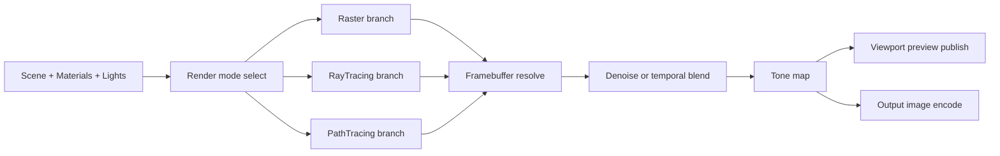

# Renderovani

Tento dokument popisuje aktualni renderer stack, jeho runtime logiku a rozdily mezi viewport preview a output renderem.

## Render atlas

| Rezim | Trida | Charakter | Typicky use-case |
| --- | --- | --- | --- |
| MODEL | RasterRenderer (modelPreviewMode) | ultra lehky unlit preview | rychla navigace v scene |
| BASIC | RasterRenderer (flat/unlit) | technicky prehled bez fyziky | blokovani kompozice |
| PHONG | RasterRenderer + PhongShader | realtime osvetleni | bezna editace a animace |
| WIREFRAME | WireframeRenderer | topologie + siluety + skryte hrany | kontrola meshe |
| DITHERING | DitherRenderer | stylizace (blue noise, pattern, ascii) | lookdev styl |
| TEMPORAL_NOISE | TemporalNoiseRenderer | casove rizeny sum na zaklade G-bufferu | atmosfericky efekt |
| HEX_MOSAIC | HexMosaicRenderer | bunecna stylizace | graficky look |
| RAY_TRACING | RayTracerRenderer | carrier offline preview | kvalitni iterace materialu a svetel |
| PATH_TRACING | PathTracerRenderer | Monte Carlo integrace | referencni fyzikalni vystup |

## Pipeline mapa (od scene po pixel)

## Viewport vs output render

| Oblast | Viewport (interaktivni) | Output (offline export) |
| --- | --- | --- |
| Ridici smycka | frame-by-frame live loop | cilove vzorky na frame |
| Reakce na pohyb kamery | motion tiers, cadence gate, subset tile update | kamera je typicky stabilni na frame; pocita se do targetSamples |
| Worker/tile policy | auto tuning muze bezet | v outputu se obvykle fixuje workerCount a tileSize |
| Denoise | muze byt adaptivni podle faze | QUALITY profil, FULL_FRAME runtime |
| Ukonceni | kontinuum do dalsiho frame | smycka konci po targetSamples + finalize |

## Spolecny matematicky zaklad

### Transformace

$$
\mathbf{p}_{world} = M\,\begin{bmatrix}x\\y\\z\\1\end{bmatrix},
\qquad
\mathbf{p}_{clip} = VP\,\mathbf{p}_{world}
$$

$$
\mathbf{p}_{ndc} = \frac{\mathbf{p}_{clip.xyz}}{w_{clip}}
$$

$$
x_{screen}=\left(\frac{x_{ndc}}{2}+\frac{1}{2}\right)(W-1),
\quad
y_{screen}=\left(1-\left(\frac{y_{ndc}}{2}+\frac{1}{2}\right)\right)(H-1)
$$

### Paprsek

$$
\mathbf{r}(t) = \mathbf{o} + t\mathbf{d}
$$

## Raster branch (MODEL, BASIC, PHONG)

1. Frustum culling entit.
2. Vertex transform do clip/NDC/screen.
3. Tile rasterizace trojuhelniku.
4. Z-buffer test.
5. Material + svetelna evaluace.

Phong cast pouziva ambient + Lambert + Blinn-Phong:

$$
L = L_{ambient} + \sum_{lights}(L_d + L_s)
$$

## Stylized branch (WIREFRAME, DITHERING, TEMPORAL_NOISE, HEX_MOSAIC)

Tyto rezimy jsou urcene pro citelnost a vizualni charakter, ne pro fyzikalni referenci.

- WIREFRAME: kontura + depth-hidden logika + silhouette emphasis.
- DITHERING: luminance kvantizace, threshold mapy, ascii matching.
- TEMPORAL_NOISE: regionalni casovy sum z G-buffer signalu.
- HEX_MOSAIC: agregace do hex bunek + quantized luminance + edge styl.

## Ray tracing deep dive (RAY_TRACING)

### Co je cil rendereru

Ray tracer v tomto projektu neni cisty brute-force path tracer. Je to hybridni carrier pipeline navrzena tak, aby:

1. Dala stabilni a cisty obraz i pri nizsim poctu vzorku.
2. Udrzela vysokou odezvu pri pohybu kamery.
3. Po zastaveni kamery rychle prepla do kvalitnejsiho still rezimu.

### Stavovy automat pro pohyb kamery

Ray tracing i path tracing pouzivaji stejnou logiku fazi preview:

| Faze | Co ji aktivuje | Co dela pipeline |
| --- | --- | --- |
| STILL_STEADY | kamera je stabilni | plna kvalita podle still tieru |
| MOTION_ENTER | detekovan zacatek pohybu | okamzity downgrade kvality, reset handoff stavu |
| MOTION_STEADY | kamera se stale hybe | reduced cadence, subset dlazdice, agresivnejsi limity |
| MOTION_EXIT_RESYNC | kamera se zastavila | kratka resynchronizace temporal historie |
| STILL_WARMUP | po exit resync | nekolik warmup framu pred navratem do STILL_STEADY |

Konstanty still quality ladderu maji stejne sample prahy v obou tracerech:

- tier1 od 12 samples
- tier2 od 28 samples
- tier3 od 48 samples
- tier4 od 72 samples
- tier5 od 100 samples

### Kamera stoji vs kamera se hybe (ray tracing)

| Stav kamery | Aktivni chovani |
| --- | --- |
| Kamera stoji | vyssi quality tier, vice sekundarnich jevu, silnejsi reflection carry boost, plnejsi denoise cadence |
| Kamera se hybe | motion tier profil, omezeni secondary contribution, nizsi sampling budget na frame, subset tile update |

Konfigurovatelne motion ridice zahrnuji:

- previewMotionSecondaryCadence
- previewMotionTileSubsetCadence
- previewMotionDenoiseCadence
- previewMotionBaseCompositeCadence
- previewMotionSamplesPerFrameLimit
- previewMotionDepthLimit
- previewMotionMaxLocalLights
- previewMotionMaxShadowedLocalLights
- previewMotionThroughputTermination
- previewMotionRoughnessSecondarySkip
- previewMotionPolishScale
- previewMotionBaseShadingScale

### Camera reset a akumulace

Kamera neni jen binary "zmenila se / nezmenila".

1. Vypocita se camera snapshot a motion delta.
2. Porovna se plny signature hash.
3. Pri zmene se urci reset kind (soft/hard podle typu zmeny).
4. applyCameraReset rozhodne, zda zachovat cast akumulace nebo vynutit reset.

To je dulezite hlavne pri jemnem pohybu, kde cilem neni kazdy frame zahodit celou historii.

### Ray tracing frame pipeline

1. Signature pass: geometry, lighting, camera.
2. Pripadne rebuild geometry/light cache.
3. Preview phase update (still/motion state machine).
4. Resolve quality plan a efektivni samplesPerFrame.
5. Tile scheduling a worker dispatch.
6. BVH traversal + local lighting + secondary branch.
7. Prubezna akumulace do runtime bufferu.
8. Denoise gate (podle faze a cadence).
9. Temporal blend / composite.
10. Tone map + zapis do framebufferu.

### Ray tracing v output pipeline

V output kontroleru se pro ray tracing explicitne nastavuje:

- fixed workerCount, tileSize, samplesPerStep
- maxDepth, directLighting, shadows, reflections, sky
- adaptiveSampling + adaptive threshold
- denoise profile QUALITY + runtime FULL_FRAME

Smycka renderu pak bezi, dokud accumulatedSamples nedosahnou targetSamples. Mezi kroky se publikuje prubezny preview snimek, po dokonceni finalize preview + shutdown rendereru.

## Path tracing deep dive (PATH_TRACING)

### Dve transport cesty: preview a reference

Path tracer ma dva vykonove i kvalitativne odlisne behy:

1. Preview mode: optimalizovany pro interaktivitu, muze omezit cast jevu podle faze.
2. Reference mode: cilem je vernost, vypina cast preview heuristik a drzi konzervativnejsi integraci.

Output controller prepina referenceMode podle render jobu a soucasne ridi historyFireflyClamp tak, aby reference render nebyl zbytecne orezan preview clampem.

### Integracni jadro

Path tracing je Monte Carlo estimator radiance:

$$
L_o = \int_{\Omega} f_r(\omega_i, \omega_o)\,L_i(\omega_i)\,(\mathbf{n}\cdot\omega_i)\,d\omega_i
$$

Prakticka diskretni forma v implementaci:

$$
\mathbf{L} \leftarrow \mathbf{L} + \mathbf{T}\odot\mathbf{L}_{direct}
$$

$$
\mathbf{T}_{k+1} = \mathbf{T}_k \odot \frac{\mathbf{w}_{branch}}{p_{branch}}
$$

Branching je rizene pravdepodobnostmi prenos/specular/diffuse/clearcoat. Kompenzace pres $1/p_{branch}$ drzi estimator unbiased.

Russian roulette (typicky od vyssich bounce) ukoncuje dlouhe trasy:

$$
rr = clamp(\max(T_r,T_g,T_b), 0.05, 0.98)
$$

$$
P(continue)=rr, \qquad \mathbf{T}\leftarrow\mathbf{T}/rr
$$

### Kamera stoji vs kamera se hybe (path tracing)

Path tracer ma stejnou preview phase mechaniku, ale jina rozhodnuti uvnitr integratoru.

| Stav | Co se uvnitr meni |
| --- | --- |
| Kamera stoji | aktivuji se still quality plany, muze rust effectiveMaxBounces, direct lighting a transmission drzi plny profil |
| Kamera se hybe | motion tier redukuje bounce budget, muze omezit throughput a subset coverage, denoise bezi v motion cadence |

Konkretni motion ridice v path traceru:

- previewMotionSecondaryCadence
- previewMotionDenoiseCadence
- previewMotionTileSubsetCadence
- previewMotionSamplesPerFrameLimit
- previewMotionMaxDepth (alias maxBounces)
- previewMotionThroughputTermination

Path tracer navic drzi aktivni quality identifikatory:

- activePreviewQualityTier
- activeMotionQualityTier
- activeStillMaxBounces
- activeStillDirectLightingEnabled

### Priame svetlo, environment, emisivni vetve

Pri tracePath se pro kazdy bounce rozhoduje, ktere prispevky se pocitaji:

1. directLightingActive
2. transmissionEnabled
3. environmentSampleCount
4. emissiveSampleCount

Volba zavisi na kombinaci:

- previewMotionActive
- referenceMode
- aktivni still tier

Tzn. pri pohybu se cast cesty zjednodusi kvuli stabilite frame time, po zastaveni kamery se pipeline vraci k plnejsimu modelu.

### DOF a motion blur v path traceru

Path tracer ma interni camera optiku:

- cameraDofEnabled
- cameraMotionBlurEnabled
- cameraShutterFraction

DOF/motion blur se do camera state promita pres feature weighting. Pri velmi agresivnim motion tieru muze byt efektivne potlaceno, aby se stabilizoval noise profil.

### Denoise a firefly management

Path tracer ma vicestupnovy denoise stack:

1. Guide capture (normal/depth/albedo related signal).
2. Runtime orchestrator (AUTO/FULL_FRAME/tile profile podle nastaveni).
3. History firefly clamp v preview modu.
4. Volitelny reference clamp v referencnim modu.

To je hlavni duvod, proc path tracing v preview a v output reference muze mit odlisny charakter sumu i konvergence.

### Path tracing frame pipeline

1. Signature check + reset rozhodnuti.
2. Preview phase update.
3. Resolve effectiveSamplesPerFrame + effectiveMaxBounces.
4. Build camera state (vcetne motion blur source snapshot).
5. Tile schedule + parallel trace.
6. tracePath (preview nebo reference transport).
7. Accumulation + optional firefly clamp.
8. Denoise and resolve (cadence aware).
9. Temporal blend and final compose.
10. Tone map + framebuffer write.

### Path tracing v output pipeline

Output path renderer dostava navic parametry:

- referenceMode
- historyFireflyClamp (typicky vypnuto v reference)
- clampDirect / clampIndirect
- referenceClamp

Stejne jako ray tracing bezi smycka do targetSamples, s prubeznym publish viewport preview a final publish po dokonceni.

## Presnost vs vykon

| Rezim | Fyzikalni vernost | Casova cena | Poznamka |
| --- | --- | --- | --- |
| MODEL/BASIC | nizka | velmi nizka | editor orientace |
| PHONG | stredni | nizka | hlavni realtime rezim |
| Stylized (wireframe/dither/temporal/hex) | cilene ne-fyzikalni | nizka az stredni | look a diagnostika |
| RAY_TRACING | vyssi | vysoka | stabilni quality preview |
| PATH_TRACING preview | vysoka | velmi vysoka | interaktivni fyzikalni nahled |
| PATH_TRACING reference | nejvyssi | nejvyssi | finalni export |

## Prakticky zaver

Nejdulezitejsi architektonicky bod je stavovy prechod mezi "kamera se hybe" a "kamera stoji".

- Pri pohybu oba tracery zjednodusuji pipeline, aby udrzely odezvu.
- Pri stabilni kamere oba tracery vraci plnejsi svetelnou logiku a vyssi quality tier.
- Output render tento mechanismus pouziva jako deterministickou sample smycku do targetSamples, aby sel reprodukovatelne do finalu.
